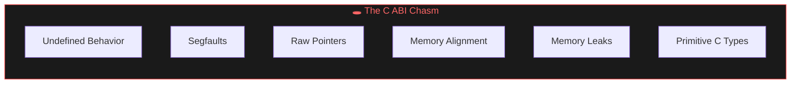
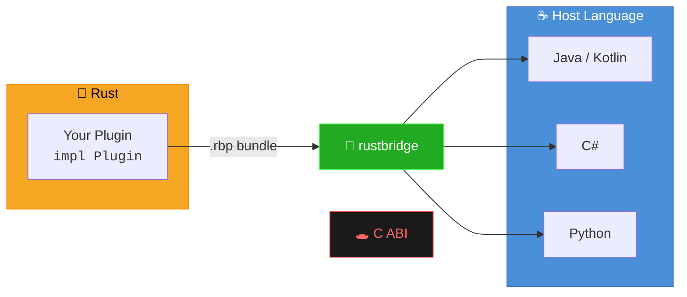

# rustbridge

[](https://github.com/jrobhoward/rustbridge/actions/workflows/ci.yml)
[](LICENSE-MIT)
[](https://www.rust-lang.org)
[](https://openjdk.org)
[](https://dotnet.microsoft.com)
[](https://www.python.org)
[-lightblue.svg)](https://go.dev)
[-lightblue.svg)](https://www.erlang.org)
[](https://crates.io/crates/rustbridge-cli)
[](https://central.sonatype.com/namespace/io.github.jrobhoward.rustbridge)
[](https://pypi.org/project/rustbridge/)
[](https://www.nuget.org/packages/RustBridge.Core)

**rustbridge** lets you write shared library plugins in Rust that can be called from Java, Kotlin, C#, Python, Go, Erlang, or another version of Rust — without dealing with the C ABI directly.

## The Problem


```mermaid
flowchart LR
    subgraph chasm["🕳️ The C ABI Chasm"]
        direction TB
        ub["Undefined Behavior"]
        seg["Segfaults"]
        ptr["Raw Pointers"]
        align["Memory Alignment"]
        leak["Memory Leaks"]
        types["Primitive C Types"]
        style chasm fill: #1a1a1a, stroke: #ff4444, color: #ff6666
    end
```

Calling Rust from other languages typically means writing C bindings. That means dealing with:

- **Undefined behavior** from incorrect memory handling
- **Segfaults** from null pointers or use-after-free
- **Memory leaks** from forgotten deallocations
- **Type mismatches** between languages
- **No error handling** (C has no exceptions or Result types)
- **Manual serialization** of complex data structures

One of your goals may be to work exclusively in memory safe languages, but in order to get from one language to the
other, you'll need to cross _the C ABI Chasm_.

## A Solution

With **rustbridge**, you can write a plugin once, and call it from various languages without needing to _cross the C ABI
chasm_ directly:


```mermaid
flowchart LR
    subgraph safe_rust["🦀 Rust"]
        plugin["Your Plugin<br/><code>impl Plugin</code>"]
    end

subgraph crossing[" "]
direction TB
bridge["🌉 rustbridge"]
chasm["🕳️ C ABI"]
end

subgraph safe_host["☕ Host Language"]
java["Java / Kotlin"]
csharp["C#"]
python["Python"]
end

plugin -- " .rbp bundle " --> bridge
bridge --> java
bridge --> csharp
bridge --> python

style chasm fill: #1a1a1a, stroke:#ff4444, color: #ff6666
style bridge fill:#22aa22, stroke: #44ff44, color: #ffffff
style crossing fill: none, stroke: none
style safe_rust fill: #f5a623, stroke: #ff8c00,color: #000000
style safe_host fill: #4a90d9,stroke: #2e6cb5, color: #ffffff
```

rustbridge handles the messy bits. You get:

- **High-level JSON, native Rust speed** — Work with serde types, not raw pointers
- **Stable C ABI** — Plugins work regardless of your Rust compiler version or optimization flags
- **One plugin, many languages** — Same binary called from Java, Kotlin, C#, Python, Go, or Erlang
- **Production-ready bundles** — Code signing, SBOM, checksums, multi-platform support
- **Managed lifecycle** — Startup, shutdown, and logging callbacks built-in

## Project Status

Components planned for a 1.0 release:

| Component         | Status      |
|-------------------|-------------|
| JSON Transport    | Stable      |
| Plugin Lifecycle  | Stable      |
| Bundle Format     | Stable      |
| Java FFM Bindings | Stable      |
| C# Bindings       | Stable      |
| Python Bindings   | Stable      |
| Binary Transport  | Stable      |
| Documentation     | Stable      |

## The .rbp Bundle

Plugins ship as `.rbp` bundles (portable ZIP files containing at a minimum: a manifest and one or more shared
libraries).
An `.rbp` bundle may also include:

| Feature            | Description                                                    |
|--------------------|----------------------------------------------------------------|
| **Multi-platform** | Linux, macOS, Windows (x64 + ARM64) may be bundled in one file |
| **Code signing**   | Minisign signatures for authenticity verification              |
| **SBOM**           | CycloneDX and SPDX for supply chain transparency               |
| **Variants**       | Release + debug builds, custom feature flags                   |
| **Checksums**      | SHA256 verification of all binaries                            |
| **Provenance**     | Git commit, CI job, build timestamp tracking                   |

Create a bundle from your plugin directory:

```bash
rustbridge pack
```

Or use `rustbridge bundle create` for multi-platform bundles:

```bash
rustbridge bundle create \
  --name my-plugin --version 1.0.0 \
  --lib linux-x86_64:target/release/libmyplugin.so \
  --lib darwin-aarch64:target/release/libmyplugin.dylib \
  --lib windows-x86_64:target/release/myplugin.dll \
  --output my-plugin-1.0.0.rbp
```

Load from any language; rustbridge will auto-detect the platform:

```java
Plugin plugin = BundleLoader.load("my-plugin-1.0.0.rbp");
```

## Quick Example

**Rust plugin:**

```rust
use rustbridge::prelude::*;

#[derive(Default)]
pub struct EchoPlugin;

#[async_trait]
impl Plugin for EchoPlugin {
    async fn handle_request(&self, _ctx: &PluginContext, type_tag: &str, payload: &[u8]) -> PluginResult<Vec<u8>> {
        match type_tag {
            "echo" => Ok(payload.to_vec()),  // Echo back the input
            _ => Err(PluginError::UnknownMessageType(type_tag.to_string())),
        }
    }
}

rustbridge_entry!(EchoPlugin::default);
```

**Java consumer:**

```java
try (Plugin plugin = FfmPluginLoader.load("libecho.so")) {
    String response = plugin.call("echo", "{\"message\": \"Hello!\"}");
    System.out.println(response);  // {"message": "Hello!"}
}
```

## Get Started

The fastest way to understand rustbridge is to build something:

📖 **[Getting Started Guide](https://github.com/jrobhoward/rustbridge/blob/main/docs/GETTING_STARTED.md)** — Create your
first plugin and call it from Java

## Language Guides

| Language | Version   | Guide                                                                                                               |
|----------|-----------|---------------------------------------------------------------------------------------------------------------------|
| Java     | 21+       | [docs/using-plugins/JAVA_FFM.md](https://github.com/jrobhoward/rustbridge/blob/main/docs/using-plugins/JAVA_FFM.md) |
| Kotlin   | 2.0+      | [docs/using-plugins/KOTLIN.md](https://github.com/jrobhoward/rustbridge/blob/main/docs/using-plugins/KOTLIN.md)     |
| C#       | .NET 8.0+ | [docs/using-plugins/CSHARP.md](https://github.com/jrobhoward/rustbridge/blob/main/docs/using-plugins/CSHARP.md)     |
| Python   | 3.10+     | [docs/using-plugins/PYTHON.md](https://github.com/jrobhoward/rustbridge/blob/main/docs/using-plugins/PYTHON.md)     |
| Rust     | 1.90+     | [docs/using-plugins/RUST.md](https://github.com/jrobhoward/rustbridge/blob/main/docs/using-plugins/RUST.md)         |
| Go       | 1.21+     | [docs/using-plugins/GO.md](https://github.com/jrobhoward/rustbridge/blob/main/docs/using-plugins/GO.md) (Tier 2)    |
| Erlang   | OTP 27+   | [docs/using-plugins/ERLANG.md](https://github.com/jrobhoward/rustbridge/blob/main/docs/using-plugins/ERLANG.md) (Tier 2) |

> **Note**: Java 21 users must add `--enable-preview` flag. It works, but Java 22+ is recommended.
> **Note**: Rust consumers must be created as separate projects with `cargo new` to avoid workspace conflicts.
> **Note**: Go and Erlang are **Tier 2** — expected to work, tested on Linux, but not all OS permutations validated. See [Architecture](https://github.com/jrobhoward/rustbridge/blob/main/docs/ARCHITECTURE.md#language-support-tiers) for tier definitions.

## Installation

Install the CLI and language libraries from published packages:

```bash
cargo install rustbridge-cli                                                # CLI (crates.io)
pip install rustbridge                                                      # Python (PyPI)
dotnet add package RustBridge.Core && dotnet add package RustBridge.Native   # C# (NuGet)
```

Java/Kotlin dependencies are available on Maven Central as `io.github.jrobhoward.rustbridge:rustbridge-ffm:1.0.0`.

📖 **[Full Installation Guide](https://github.com/jrobhoward/rustbridge/blob/main/docs/INSTALL.md)** — All languages
and package managers.

For contributors building from source, see the
[Development Guide](https://github.com/jrobhoward/rustbridge/blob/main/docs/DEVELOPMENT.md).

## Contributing

We welcome contributions! See [CONTRIBUTING.md](https://github.com/jrobhoward/rustbridge/blob/main/CONTRIBUTING.md) for
guidelines.

**Quick start:**

1. Check the [issue tracker](https://github.com/jrobhoward/rustbridge/issues) for open tasks
2. Read [docs/SKILLS.md](https://github.com/jrobhoward/rustbridge/blob/main/docs/SKILLS.md) for coding conventions
3. Read [docs/TESTING.md](https://github.com/jrobhoward/rustbridge/blob/main/docs/TESTING.md) for testing guidelines

## Technical Documentation

For those who want to understand the internals:

- [Architecture](https://github.com/jrobhoward/rustbridge/blob/main/docs/ARCHITECTURE.md) — System design and component
  overview
- [Bundle Format](https://github.com/jrobhoward/rustbridge/blob/main/docs/BUNDLE_FORMAT.md) — .rbp specification
- [Transport Layer](https://github.com/jrobhoward/rustbridge/blob/main/docs/TRANSPORT.md) — JSON and binary protocols
- [Memory Model](https://github.com/jrobhoward/rustbridge/blob/main/docs/MEMORY_MODEL.md) — Ownership patterns across
  FFI
- [Error Handling](https://github.com/jrobhoward/rustbridge/blob/main/docs/ERROR_HANDLING.md) — Error codes and patterns
- [Plugin Lifecycle](https://github.com/jrobhoward/rustbridge/blob/main/docs/PLUGIN_LIFECYCLE.md) — State machine
  details

## Changelog

See [CHANGELOG.md](https://github.com/jrobhoward/rustbridge/blob/main/CHANGELOG.md) for version history.

## License

MIT OR Apache-2.0

### Attribution

This project includes software licensed under the Unicode License.
See [NOTICES](https://github.com/jrobhoward/rustbridge/blob/main/NOTICES) for details.
