# rustbridge

[](https://github.com/jrobhoward/rustbridge/actions/workflows/ci.yml)
[](LICENSE-MIT)
[](https://www.rust-lang.org)
[](https://openjdk.org)
[](https://dotnet.microsoft.com)
[](https://www.python.org)

> [!CAUTION]
> **Beta Software** — This project is under active development and not yet recommended for production use.
> - Bundle format (`.rbp`) should be stable, but may require additional extensions before the 1.0 release
> - JSON transport is also approaching stability
> - Binary transport is experimental
> - Installed locally from source: Not yet published to package registries (Maven Central, NuGet, PyPI)
> - API documentation is incomplete

**rustbridge** lets you write plugins in Rust that can be called from Java, Kotlin, C#, or Python—without dealing with
the C ABI directly.

## The Problem

```mermaid
flowchart LR
    subgraph chasm["🕳️ The C ABI Chasm"]
        direction TB
        ub["Undefined Behavior"]
        seg["Segfaults"]
        ptr["Raw Pointers"]
        align["Memory Alignment"]
        leak["Memory Leaks"]
        types["Primitive C Types"]
        style chasm fill: #1a1a1a, stroke: #ff4444, color: #ff6666
    end
```



Calling Rust from other languages typically means writing C bindings. That means dealing with:

- **Undefined behavior** from incorrect memory handling
- **Segfaults** from null pointers or use-after-free
- **Memory leaks** from forgotten deallocations
- **Type mismatches** between languages
- **No error handling** (C has no exceptions or Result types)
- **Manual serialization** of complex data structures

## A Solution

With **rustbridge**, you can write a plugin once, and call it from various languages without needing to _cross the C ABI
chasm_ yourself:

```mermaid
flowchart LR
    subgraph safe_rust["🦀 Rust"]
        plugin["Your Plugin<br/><code>impl Plugin</code>"]
    end

subgraph crossing[" "]
direction TB
bridge["🌉 rustbridge"]
chasm["🕳️ C ABI"]
end

subgraph safe_host["☕ Host Language"]
java["Java / Kotlin"]
csharp["C#"]
python["Python"]
end

plugin -- " .rbp bundle " --> bridge
bridge --> java
bridge --> csharp
bridge --> python

style chasm fill: #1a1a1a, stroke:#ff4444, color: #ff6666
style bridge fill:#22aa22, stroke: #44ff44, color: #ffffff
style crossing fill: none, stroke: none
style safe_rust fill: #f5a623, stroke: #ff8c00,color: #000000
style safe_host fill: #4a90d9,stroke: #2e6cb5, color: #ffffff
```



rustbridge handles the messy bits for you. You write a simple Rust trait implementation, and rustbridge provides:

- **Safe memory management** across the FFI boundary
- **JSON serialization** for request/response data
- **Structured error handling** with typed error codes
- **Plugin lifecycle management** (startup, shutdown, health checks)
- **Logging callbacks** that integrate with your host language
- **Portable bundles** (`.rbp` files) that work on multiple platforms

## Get Started

The fastest way to understand rustbridge is to build something:

📖 **[Getting Started Guide](https://github.com/jrobhoward/rustbridge/blob/main/docs/GETTING_STARTED.md)** — Create your
first plugin and call it from Java

Or dive into the tutorials (more to come):

| Tutorial                                                                                                       | What You'll Learn                                  |
|----------------------------------------------------------------------------------------------------------------|----------------------------------------------------|
| [Build a Regex Plugin](https://github.com/jrobhoward/rustbridge/blob/main/docs/tutorials/01-regex-plugin/)     | Rust plugin development, message handling, caching |
| [Call from Kotlin](https://github.com/jrobhoward/rustbridge/blob/main/docs/tutorials/02-kotlin-consumer/)      | Type-safe calls, logging integration, benchmarking |
| [Build a JSON Plugin](https://github.com/jrobhoward/rustbridge/blob/main/docs/tutorials/03-json-plugin/)       | Validation, error handling patterns                |
| [Call from Java](https://github.com/jrobhoward/rustbridge/blob/main/docs/tutorials/04-java-consumer/)          | FFM/JNI setup, Gradle configuration                |
| [Production Bundles](https://github.com/jrobhoward/rustbridge/blob/main/docs/tutorials/05-production-bundles/) | Code signing, schemas, SBOMs                       |
| [Cross-Compilation](https://github.com/jrobhoward/rustbridge/blob/main/docs/tutorials/06-cross-compilation/)   | Building for multiple platforms                    |

## Quick Example

**Rust plugin:**

```rust
use rustbridge::prelude::*;

#[derive(Default)]
pub struct EchoPlugin;

#[async_trait]
impl Plugin for EchoPlugin {
    async fn handle_request(&self, _ctx: &PluginContext, type_tag: &str, payload: &[u8]) -> PluginResult<Vec<u8>> {
        match type_tag {
            "echo" => Ok(payload.to_vec()),  // Echo back the input
            _ => Err(PluginError::UnknownMessageType(type_tag.to_string())),
        }
    }
}

rustbridge_entry!(EchoPlugin::default);
```

**Java consumer:**

```java
try (Plugin plugin = FfmPluginLoader.load("libecho.so")) {
    String response = plugin.call("echo", "{\"message\": \"Hello!\"}");
    System.out.println(response);  // {"message": "Hello!"}
}
```

**Kotlin, C#, and Python** are just as simple. See the [language guides](#language-guides) below.

## The .rbp Bundle

Plugins are distributed as `.rbp` bundles—portable ZIP files containing libraries for multiple platforms:

```bash
# Create a multi-platform bundle
rustbridge bundle create \
  --name my-plugin --version 1.0.0 \
  --lib linux-x86_64:target/release/libmyplugin.so \
  --lib darwin-aarch64:target/release/libmyplugin.dylib \
  --lib windows-x86_64:target/release/myplugin.dll \
  --output my-plugin-1.0.0.rbp
```

Load from any language—rustbridge auto-detects the platform:

```java
Plugin plugin = BundleLoader.load("my-plugin-1.0.0.rbp");
```

## Language Guides

| Language   | Version   | Guide                                                                                                               |
|------------|-----------|---------------------------------------------------------------------------------------------------------------------|
| Java (FFM) | 21+       | [docs/using-plugins/JAVA_FFM.md](https://github.com/jrobhoward/rustbridge/blob/main/docs/using-plugins/JAVA_FFM.md) |
| Java (JNI) | 17+       | [docs/using-plugins/JAVA_JNI.md](https://github.com/jrobhoward/rustbridge/blob/main/docs/using-plugins/JAVA_JNI.md) |
| Kotlin     | 21+       | [docs/using-plugins/KOTLIN.md](https://github.com/jrobhoward/rustbridge/blob/main/docs/using-plugins/KOTLIN.md)     |
| C#         | .NET 8.0+ | [docs/using-plugins/CSHARP.md](https://github.com/jrobhoward/rustbridge/blob/main/docs/using-plugins/CSHARP.md)     |
| Python     | 3.10+     | [docs/using-plugins/PYTHON.md](https://github.com/jrobhoward/rustbridge/blob/main/docs/using-plugins/PYTHON.md)     |

## Building from Source

rustbridge is not yet published to package registries. Build from source:

**Rust CLI** (for creating plugins and bundles):

```bash
git clone https://github.com/jrobhoward/rustbridge.git
cd rustbridge
cargo install --path crates/rustbridge-cli
```

**Java/Kotlin** (build and publish to local Maven):

```bash
cd rustbridge-java
./gradlew publishToMavenLocal
```

Then in your project's `build.gradle.kts`:

```kotlin
repositories {
    mavenLocal()
}
dependencies {
    implementation("com.rustbridge:rustbridge-ffm:0.6.2")  // Java 21+
    // or
    implementation("com.rustbridge:rustbridge-jni:0.6.2")  // Java 17+
}
```

**C#** (build and reference locally):

```bash
cd rustbridge-csharp
dotnet build
```

Reference the built DLLs in your project, or use a local NuGet source.

**Python** (install in development mode):

```bash
cd rustbridge-python
pip install -e .
```

## Project Status

Here are the components planned for a 1.0 release:

| Component         | Status                |
|-------------------|-----------------------|
| JSON Transport    | Approaching stability |
| Plugin Lifecycle  | Stable                |
| Bundle Format     | Stable                |
| Java FFM Bindings | Stable                |
| Java JNI Bindings | Stable                |
| C# Bindings       | Stable                |
| Python Bindings   | Stable                |
| Binary Transport  | In development        |

## Contributing

We welcome contributions! See [CONTRIBUTING.md](https://github.com/jrobhoward/rustbridge/blob/main/CONTRIBUTING.md) for
guidelines.

**Quick start:**

1. Check [docs/TASKS.md](https://github.com/jrobhoward/rustbridge/blob/main/docs/TASKS.md) for open tasks
2. Read [docs/SKILLS.md](https://github.com/jrobhoward/rustbridge/blob/main/docs/SKILLS.md) for coding conventions
3. Read [docs/TESTING.md](https://github.com/jrobhoward/rustbridge/blob/main/docs/TESTING.md) for testing guidelines

## Technical Documentation

For those who want to understand the internals:

- [Architecture](https://github.com/jrobhoward/rustbridge/blob/main/docs/ARCHITECTURE.md) — System design and component
  overview
- [Bundle Format](https://github.com/jrobhoward/rustbridge/blob/main/docs/BUNDLE_FORMAT.md) — .rbp specification
- [Transport Layer](https://github.com/jrobhoward/rustbridge/blob/main/docs/TRANSPORT.md) — JSON and binary protocols
- [Memory Model](https://github.com/jrobhoward/rustbridge/blob/main/docs/MEMORY_MODEL.md) — Ownership patterns across
  FFI
- [Error Handling](https://github.com/jrobhoward/rustbridge/blob/main/docs/ERROR_HANDLING.md) — Error codes and patterns
- [Plugin Lifecycle](https://github.com/jrobhoward/rustbridge/blob/main/docs/PLUGIN_LIFECYCLE.md) — State machine
  details

## Changelog

See [CHANGELOG.md](https://github.com/jrobhoward/rustbridge/blob/main/CHANGELOG.md) for version history.

## License

MIT OR Apache-2.0

### Attribution

This project includes software licensed under the Unicode License.
See [NOTICES](https://github.com/jrobhoward/rustbridge/blob/main/NOTICES) for details.
