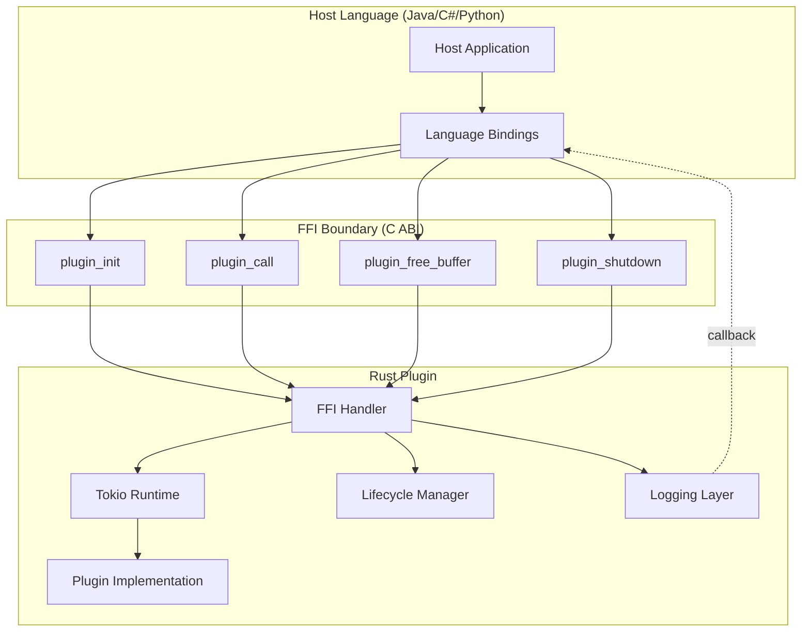
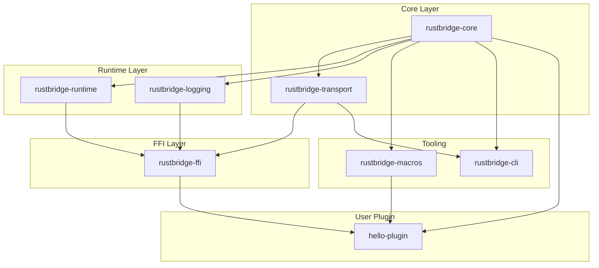
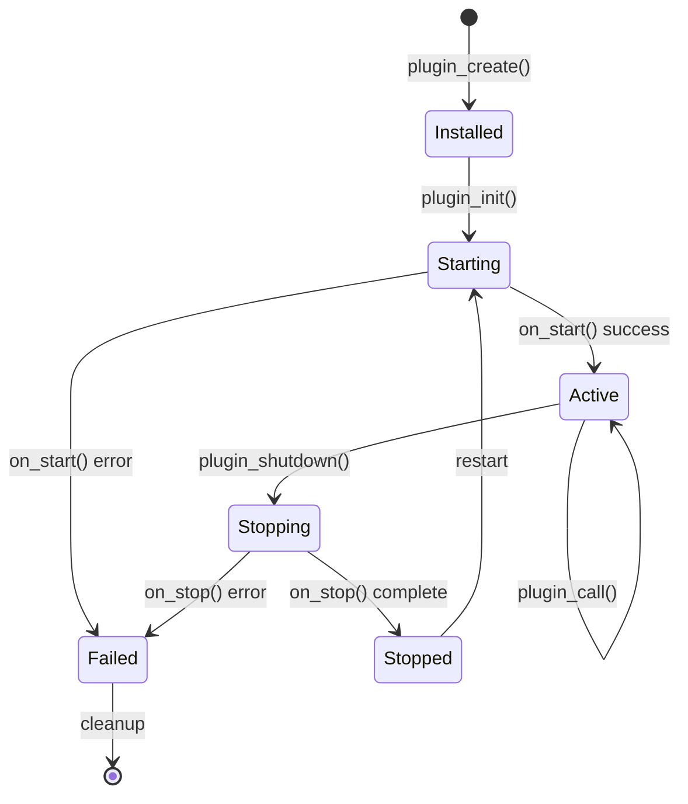
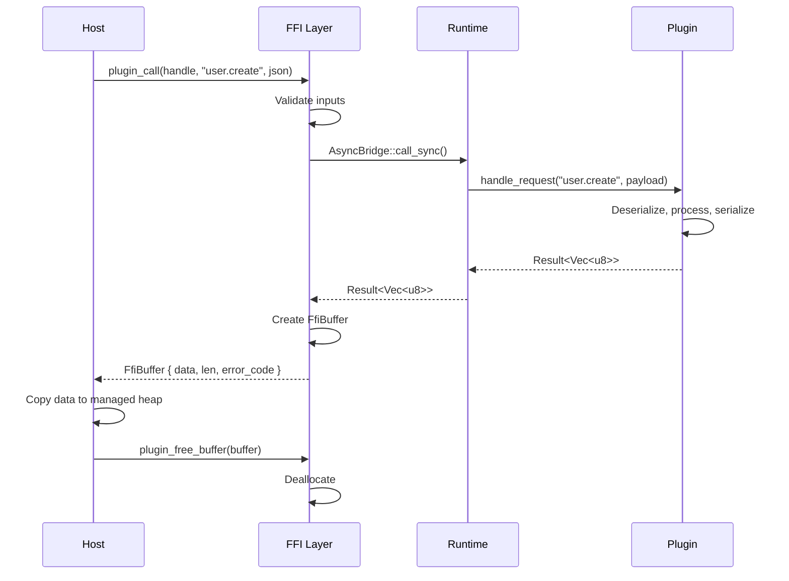
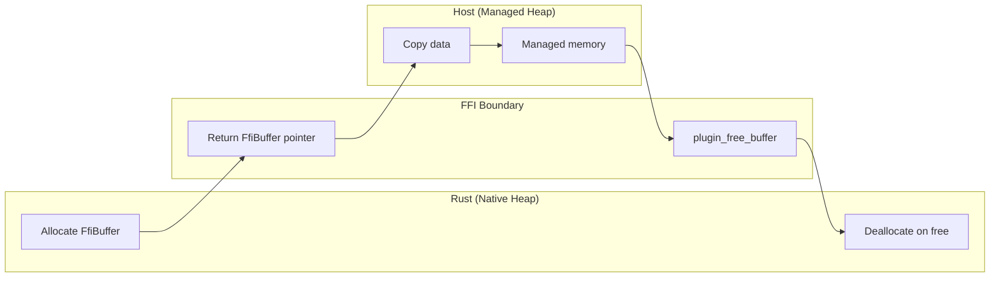
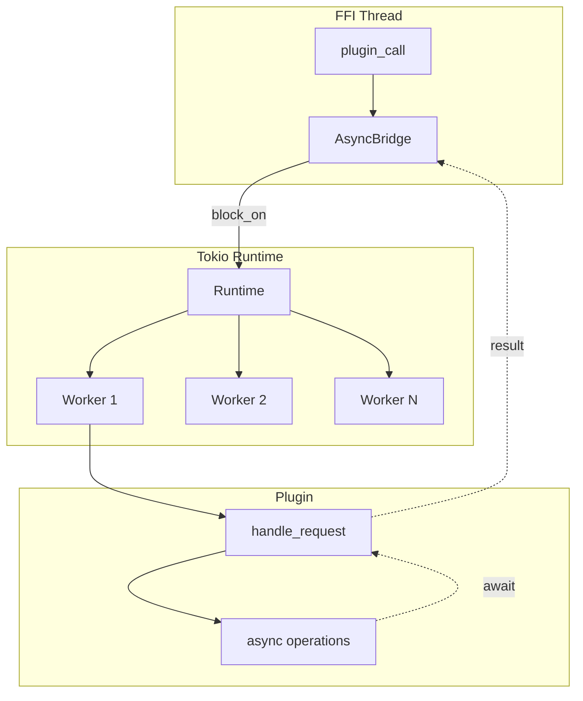
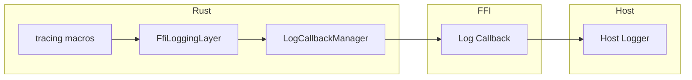
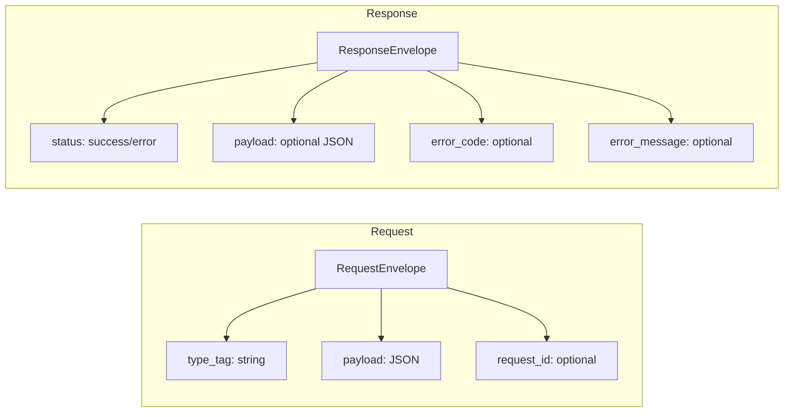
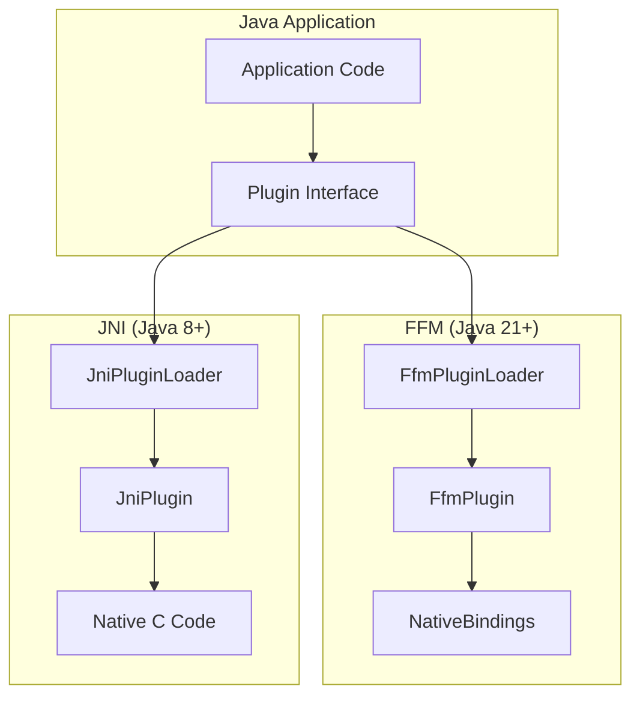
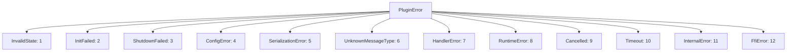

# rustbridge Architecture

This document describes the architecture of rustbridge, the design decisions made, and the tradeoffs considered.

## Overview

rustbridge is a framework for building Rust shared libraries that can be called from other programming languages. It provides a high-level abstraction over the C ABI, handling memory management, async runtime integration, lifecycle management, and logging.



## Crate Architecture

The framework is organized into focused crates with clear responsibilities:



### Crate Responsibilities

| Crate | Purpose | Key Types |
|-------|---------|-----------|
| **rustbridge-core** | Core abstractions | `Plugin`, `LifecycleState`, `PluginError`, `PluginConfig` |
| **rustbridge-transport** | Serialization | `JsonCodec`, `RequestEnvelope`, `ResponseEnvelope` |
| **rustbridge-runtime** | Async execution | `AsyncRuntime`, `AsyncBridge`, `ShutdownSignal` |
| **rustbridge-logging** | Log forwarding | `FfiLoggingLayer`, `LogCallbackManager` |
| **rustbridge-ffi** | C ABI exports | `FfiBuffer`, `PluginHandle`, FFI functions |
| **rustbridge-macros** | Code generation | `#[rustbridge_plugin]`, `derive(Message)` |
| **rustbridge-cli** | Build tooling | `new`, `build`, `generate`, `check` commands |

## Plugin Lifecycle

Plugins follow an OSGI-inspired lifecycle state machine:



### State Descriptions

| State | Description | Allowed Operations |
|-------|-------------|-------------------|
| **Installed** | Plugin created, not initialized | `plugin_init()` |
| **Starting** | Initializing runtime and resources | Wait |
| **Active** | Ready to handle requests | `plugin_call()`, `plugin_shutdown()` |
| **Stopping** | Graceful shutdown in progress | Wait |
| **Stopped** | Shutdown complete | Restart or cleanup |
| **Failed** | Error occurred | Cleanup only |

## Request/Response Flow



## Memory Management

rustbridge uses a **"Rust allocates, host frees"** pattern for memory safety:



### FfiBuffer Structure

```rust
#[repr(C)]
pub struct FfiBuffer {
    pub data: *mut u8,      // Pointer to Rust-allocated data
    pub len: usize,         // Data length in bytes
    pub capacity: usize,    // Allocation capacity
    pub error_code: u32,    // 0 = success, non-zero = error
}
```

### Memory Safety Guarantees

1. **Single ownership**: Rust owns native memory until `plugin_free_buffer()` is called
2. **No double-free**: Buffer tracks whether it's been freed
3. **No use-after-free**: Host must copy data before freeing
4. **Thread safety**: Buffer operations are not thread-safe; host must synchronize

## Async Runtime Integration

All plugins include a mandatory Tokio runtime:



### Design Decision: Mandatory Async

**Tradeoff considered**: Optional vs mandatory async runtime

| Approach | Pros | Cons |
|----------|------|------|
| **Optional async** | Smaller binary for sync-only plugins | Complex API, two code paths |
| **Mandatory async** | Simpler API, consistent behavior | ~2MB binary overhead |

**Decision**: Mandatory async. The consistency and simplicity outweigh the binary size cost. Modern applications typically need async I/O anyway.

## Logging Architecture

Logs flow from Rust's `tracing` ecosystem to the host language via callbacks:



### Log Level Mapping

| Rust Level | Numeric | Description |
|------------|---------|-------------|
| Trace | 0 | Very detailed debugging |
| Debug | 1 | Debugging information |
| Info | 2 | General information |
| Warn | 3 | Warnings |
| Error | 4 | Errors |
| Off | 5 | Logging disabled |

### Design Decision: Callback vs Queue

**Tradeoff considered**: Synchronous callbacks vs async log queue

| Approach | Pros | Cons |
|----------|------|------|
| **Callbacks** | Immediate delivery, simple | Can block Rust if host is slow |
| **Queue** | Non-blocking, buffered | Complexity, potential log loss |

**Decision**: Synchronous callbacks. Logging should be immediate for debugging. Hosts can implement buffering if needed.

## Transport Layer

### JSON-Based Protocol



### Design Decision: JSON vs Binary

**Tradeoff considered**: JSON vs MessagePack vs Protocol Buffers

| Format | Pros | Cons |
|--------|------|------|
| **JSON** | Universal, debuggable, no schema | Larger, slower |
| **MessagePack** | Compact, fast, schema-optional | Less debuggable |
| **Protobuf** | Very compact, typed | Requires schema, complex |

**Decision**: JSON as primary format. Debuggability and universal support are critical for a framework targeting multiple languages. Binary formats can be added as optional features later.

## Host Language Integration

### Java Integration Strategy



### Design Decision: FFM Primary, JNI Fallback

**Tradeoff considered**: FFM-only vs JNI-only vs both

| Approach | Pros | Cons |
|----------|------|------|
| **FFM only** | Modern, pure Java, better perf | Requires Java 21+ |
| **JNI only** | Wide compatibility | Complex, error-prone |
| **Both** | Best of both worlds | More code to maintain |

**Decision**: Support both with FFM as primary. FFM is the future, but JNI provides backward compatibility for enterprise environments on older JVMs.

## Error Handling Strategy

### Error Code Design



### Design Decision: Stable Error Codes

**Rationale**: Error codes must be stable across versions for host language error handling. Using an enum with explicit numeric mapping ensures backward compatibility.

## Security Considerations

### FFI Boundary Safety

1. **Input validation**: All FFI functions validate pointers before dereferencing
2. **Null handling**: Null pointers return error buffers, never crash
3. **No panics across FFI**: All panics are caught and converted to errors
4. **Bounded operations**: No unbounded allocations from untrusted input

### Memory Safety

1. **No raw pointer arithmetic**: Use safe Rust abstractions
2. **Clear ownership**: "Rust allocates, host frees" pattern
3. **ASAN/MSAN testing**: Regular sanitizer runs in CI

## Performance Considerations

### Overhead Sources

| Operation | Overhead | Mitigation |
|-----------|----------|------------|
| JSON serialization | ~1-10μs | Optional binary formats |
| FFI call | ~10-100ns | Batch operations if needed |
| Tokio runtime | ~2MB memory | Shared across requests |
| Log callbacks | ~1μs | Level filtering |

### Optimization Opportunities

1. **Batch requests**: Combine multiple operations in one call
2. **Binary transport**: Optional MessagePack for hot paths
3. **Arena allocation**: Reuse buffers for repeated calls
4. **Log level filtering**: Filter in Rust before callback

## Future Considerations

### Planned Extensions

1. **Async FFI API**: `plugin_call_async()` with completion callbacks
2. **Streaming**: Bidirectional streaming for large data
3. **Metrics**: Built-in performance metrics export
4. **Hot reload**: Plugin update without process restart

### Not Planned

1. **Shared memory transport**: Complexity outweighs benefits
2. **Custom allocators**: Standard allocator is sufficient
3. **Multiple runtime support**: Tokio-only simplifies API
