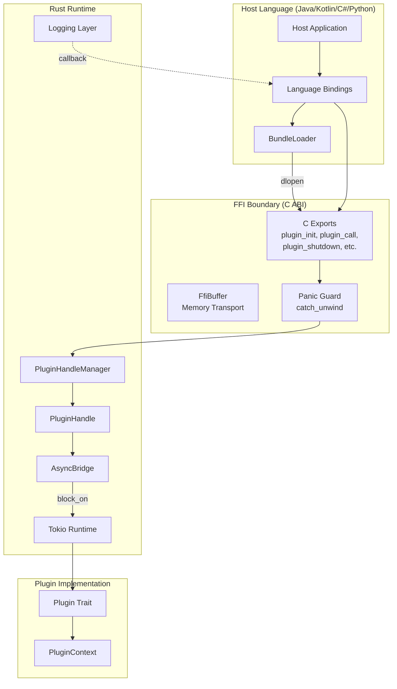
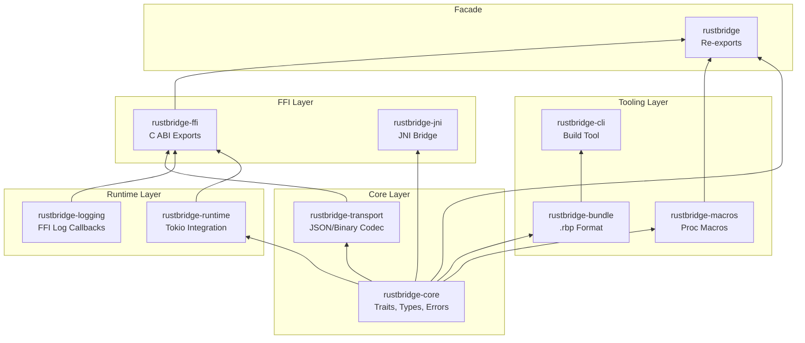
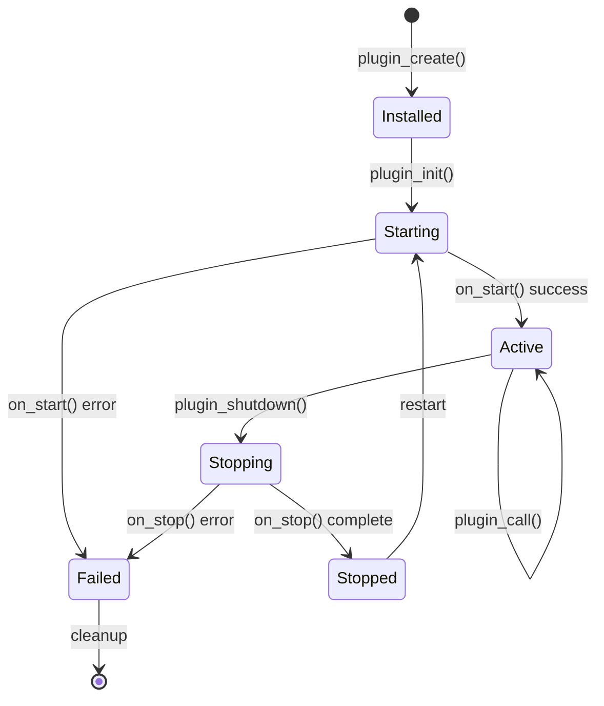
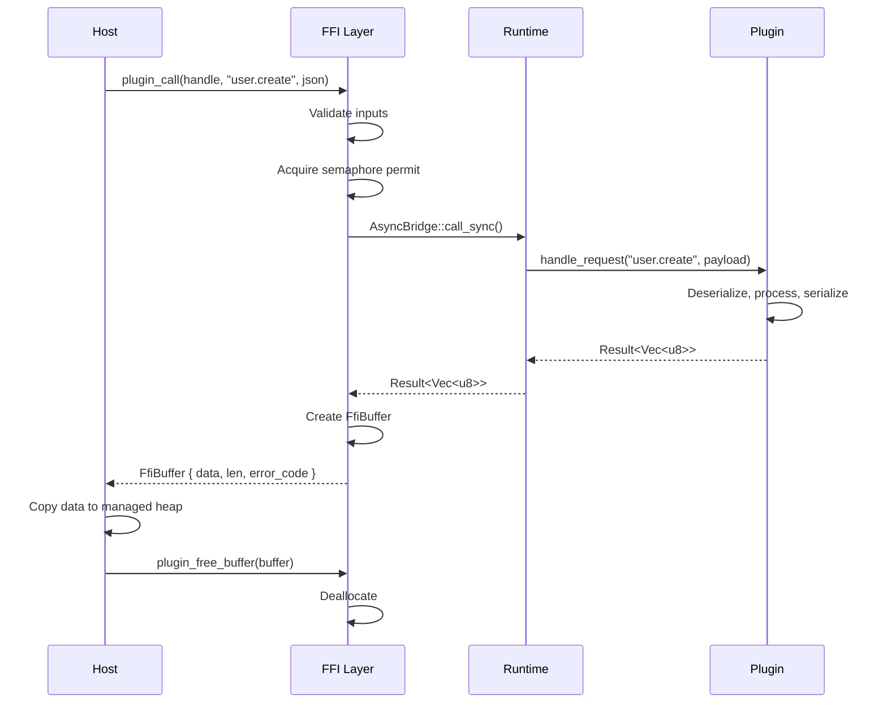
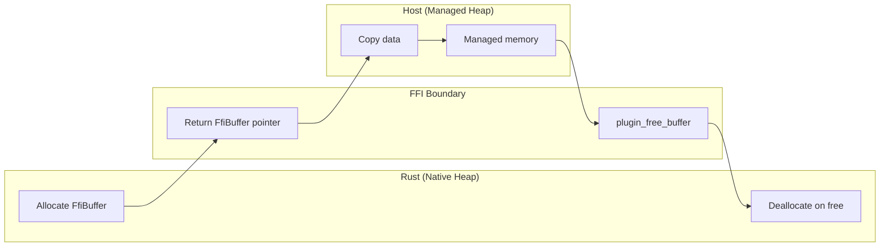
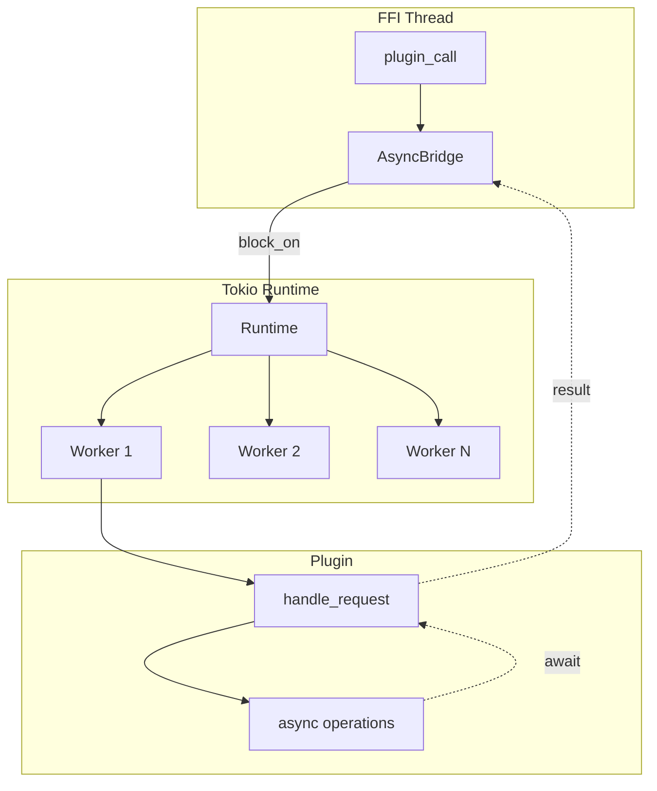
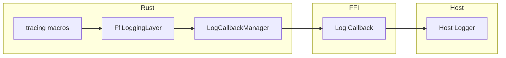
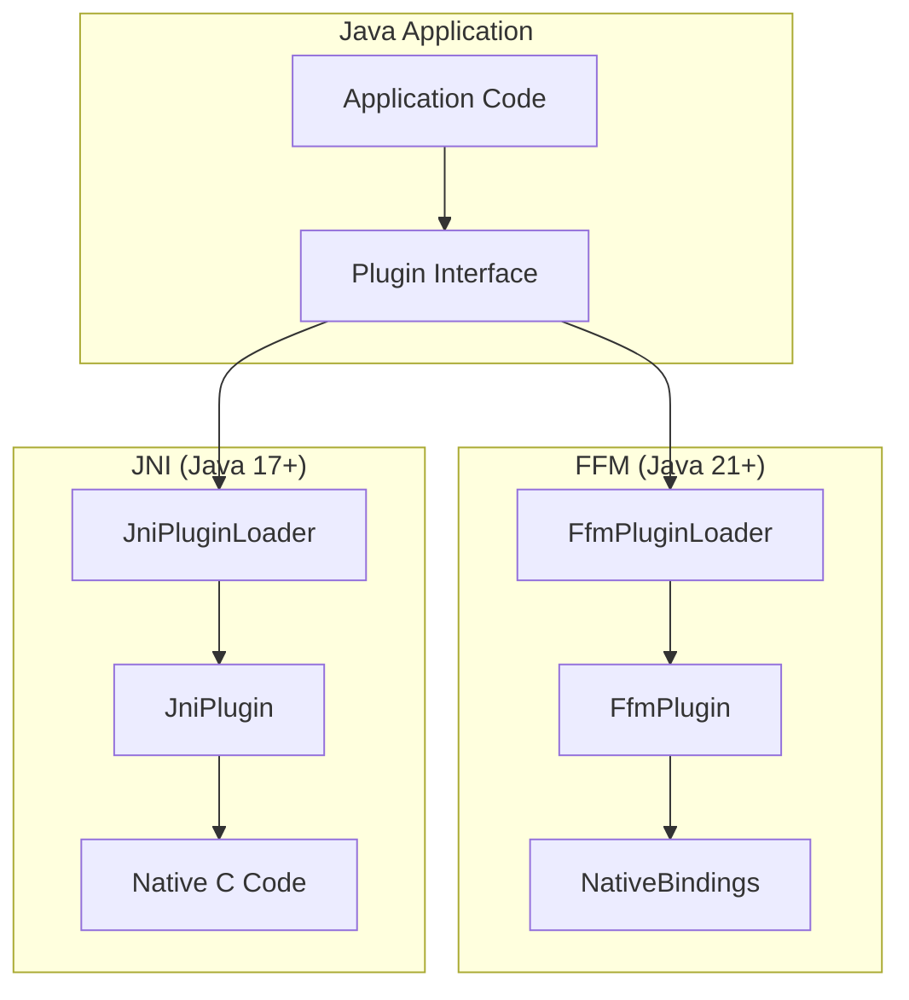

# rustbridge Architecture

This document describes the architecture of rustbridge, the design decisions made, and the tradeoffs considered.

## Overview

rustbridge is a framework for building Rust shared libraries callable from other programming languages (Java, Kotlin, C#, Python). It provides a high-level abstraction over the C ABI, handling:

- OSGI-like plugin lifecycle management
- Mandatory async runtime (Tokio) for all plugin code
- FFI logging callbacks that route Rust `tracing` to host loggers
- JSON-based data transport with optional binary transport for performance-critical paths
- Multi-platform bundle format (`.rbp`) with optional cryptographic signing



## Version Requirements

| Component | Minimum Version |
|-----------|----------------|
| Rust | 1.90.0 (Edition 2024) |
| Java (FFM) | 21+ |
| Java (JNI) | 17+ |
| .NET | 8.0+ |
| Python | 3.10+ |

## Crate Architecture

The framework is organized as a Rust workspace with layered crates:



### Crate Responsibilities

| Crate | Purpose | Key Types |
|-------|---------|-----------|
| **rustbridge-core** | Core abstractions | `Plugin`, `PluginFactory`, `LifecycleState`, `PluginError`, `PluginConfig` |
| **rustbridge-transport** | Serialization | `Codec`, `JsonCodec`, `RequestEnvelope`, `ResponseEnvelope` |
| **rustbridge-runtime** | Async execution | `AsyncRuntime`, `AsyncBridge`, `ShutdownSignal` |
| **rustbridge-logging** | Log forwarding | `FfiLoggingLayer`, `LogCallbackManager` |
| **rustbridge-ffi** | C ABI exports | `FfiBuffer`, `PluginHandle`, `RbString`, `RbBytes`, FFI functions |
| **rustbridge-jni** | JNI bindings | JNI bridge for Java 17+ |
| **rustbridge-macros** | Code generation | `#[rustbridge_plugin]`, `#[derive(Message)]`, `rustbridge_entry!` |
| **rustbridge-cli** | Build tooling | `new`, `bundle create/inspect/extract`, `keygen`, `generate-header` |
| **rustbridge-bundle** | Bundle handling | `BundleBuilder`, `BundleLoader`, `Manifest`, minisign verification |
| **rustbridge** | Facade crate | Re-exports common types for plugin authors |

## Plugin Lifecycle

Plugins follow an OSGI-inspired lifecycle state machine:



### State Descriptions

| State | Description | Allowed Operations |
|-------|-------------|-------------------|
| **Installed** | Plugin created, not initialized | `plugin_init()` |
| **Starting** | Initializing runtime and resources | Wait |
| **Active** | Ready to handle requests | `plugin_call()`, `plugin_shutdown()` |
| **Stopping** | Graceful shutdown in progress | Wait |
| **Stopped** | Shutdown complete | Restart or cleanup |
| **Failed** | Error occurred | Cleanup only |

## Request/Response Flow



## Concurrency Limits and Backpressure

rustbridge provides built-in protection against memory exhaustion under high concurrent request loads through configurable concurrency limits.

### Configuration

The `max_concurrent_ops` field in `PluginConfig` controls the maximum number of concurrent requests:

- **Limited mode (`max_concurrent_ops > 0`)**: Enforces a hard limit on concurrent requests
- **Unlimited mode (`max_concurrent_ops = 0`)**: No limit enforced (default: 1000)

```rust
let config = PluginConfig {
    max_concurrent_ops: 100,  // Allow up to 100 concurrent requests
    ..Default::default()
};
```

### Implementation

The concurrency limit is enforced using a Tokio semaphore in `PluginHandle`:

```rust
pub struct PluginHandle {
    // ... other fields
    request_limiter: Option<Arc<tokio::sync::Semaphore>>,
    rejected_requests: AtomicU64,
}
```

**Request flow with concurrency limiting:**

1. `PluginHandle::call()` attempts to acquire a permit using `try_acquire()`
2. If successful, the request proceeds and the permit is held during execution
3. If failed (limit exceeded), returns `PluginError::TooManyRequests` immediately
4. Permit is automatically released when dropped (success or error path)

**Key design decisions:**

- **Non-blocking (`try_acquire`)**: Provides immediate backpressure instead of queuing/blocking
- **Fail-fast**: Callers receive errors immediately when capacity is exceeded
- **No queuing**: Prevents unbounded memory growth from queued requests
- **RAII permits**: Automatic cleanup ensures permits are always released

### Error Handling

When the concurrency limit is exceeded:

1. **Rust**: Returns `PluginError::TooManyRequests` (error code 13)
2. **FFI**: Returns error envelope with code 13
3. **Host Languages**: Throws `PluginException` with error code 13
4. **Metrics**: `rejected_requests` counter is incremented

Callers should implement retry with backoff or load shedding strategies.

### Trade-offs

**Why try_acquire() instead of blocking acquire():**
- Immediate backpressure (fail fast)
- No thread starvation from waiting
- Caller decides retry strategy
- Simpler reasoning about resource usage

**Why semaphore instead of atomic counter:**
- Tokio semaphore is well-tested and efficient
- RAII permit automatically releases
- Handles edge cases (overflow, fairness)
- Lock-free implementation

### Tuning Recommendations

1. **Start with defaults**: The default limit of 1000 is suitable for most applications
2. **Monitor rejection rate**: High rejection rates indicate undersized limits or overload
3. **Consider request latency**: Slower requests need lower limits to prevent memory exhaustion
4. **Profile memory usage**: Set limits based on measured per-request memory consumption
5. **Use unlimited mode (0) only**: When you have external rate limiting or for low-traffic scenarios

## Memory Management

rustbridge uses a **"Rust allocates, host frees"** pattern for memory safety:



### FfiBuffer Structure

```rust
#[repr(C)]
pub struct FfiBuffer {
    pub data: *mut u8,      // Pointer to Rust-allocated data
    pub len: usize,         // Data length in bytes
    pub capacity: usize,    // Allocation capacity
    pub error_code: u32,    // 0 = success, non-zero = error
}
```

### Memory Safety Guarantees

1. **Single ownership**: Rust owns native memory until `plugin_free_buffer()` is called
2. **No double-free**: Buffer tracks whether it's been freed
3. **No use-after-free**: Host must copy data before freeing
4. **Thread safety**: Buffer operations are not thread-safe; host must synchronize

### C ABI Exports

| Function | Purpose |
|----------|---------|
| `plugin_create()` | Create plugin instance (default config) |
| `plugin_create_with_config(json, len)` | Create with configuration |
| `plugin_init(handle, config_json, len, log_callback)` | Initialize plugin, start lifecycle |
| `plugin_call(handle, type_tag, request, len)` | Synchronous request dispatch |
| `plugin_shutdown(handle)` | Graceful shutdown with timeout |
| `plugin_get_state(handle)` | Query current lifecycle state |
| `plugin_set_log_level(handle, level)` | Dynamic log level adjustment |
| `plugin_get_rejected_count(handle)` | Rate limiting statistics |
| `plugin_free_buffer(buffer)` | Deallocate response memory |

### Binary Transport Types

For high-performance scenarios, rustbridge provides zero-copy binary types:

| Type | Ownership | Purpose |
|------|-----------|---------|
| `RbString` | Borrowed | UTF-8 string reference (caller-owned) |
| `RbBytes` | Borrowed | Binary data reference (caller-owned) |
| `RbStringOwned` | Rust-owned | UTF-8 string (must free) |
| `RbBytesOwned` | Rust-owned | Binary data (must free) |
| `RbResponse` | Rust-owned | Binary response struct |

### Panic Safety

All FFI entry points are wrapped with `catch_unwind`:

```rust
pub unsafe extern "C" fn plugin_call(...) -> FfiBuffer {
    catch_panic(handle_opt, || {
        // Actual implementation
    })
}
```

- Panics return `FfiBuffer` with error code 11 (Internal)
- Plugin state transitions to Failed
- Host application continues running (no crash)

## Async Runtime Integration

All plugins include a mandatory Tokio runtime:



### AsyncBridge

The `AsyncBridge` adapts synchronous FFI calls to the async plugin API:

```rust
impl AsyncBridge {
    // Execute async code from sync FFI context
    pub fn call_sync<F, T>(&self, future: F) -> T
    where
        F: Future<Output = T>,
    {
        self.runtime.block_on(future)
    }

    // With timeout support
    pub fn call_sync_timeout<F, T>(&self, future: F, duration: Duration) -> Result<T, Timeout>;

    // Fire-and-forget spawn
    pub fn spawn<F>(&self, future: F) -> JoinHandle<F::Output>;
}
```

### Design Decision: Mandatory Async

**Tradeoff considered**: Optional vs mandatory async runtime

| Approach | Pros | Cons |
|----------|------|------|
| **Optional async** | Smaller binary for sync-only plugins | Complex API, two code paths |
| **Mandatory async** | Simpler API, consistent behavior | ~2MB binary overhead |

**Decision**: Mandatory async. The consistency and simplicity outweigh the binary size cost. Modern applications typically need async I/O anyway.

## Logging Architecture

Logs flow from Rust's `tracing` ecosystem to the host language via callbacks:



### Log Level Mapping

| Rust Level | Numeric | Description |
|------------|---------|-------------|
| Trace | 0 | Very detailed debugging |
| Debug | 1 | Debugging information |
| Info | 2 | General information |
| Warn | 3 | Warnings |
| Error | 4 | Errors |
| Off | 5 | Logging disabled |

### Design Decision: Callback vs Queue

**Tradeoff considered**: Synchronous callbacks vs async log queue

| Approach | Pros | Cons |
|----------|------|------|
| **Callbacks** | Immediate delivery, simple | Can block Rust if host is slow |
| **Queue** | Non-blocking, buffered | Complexity, potential log loss |

**Decision**: Synchronous callbacks. Logging should be immediate for debugging. Hosts can implement buffering if needed.

## Transport Layer

### JSON-Based Protocol

**Request Envelope:**
```json
{
    "type_tag": "user.create",
    "payload": {"username": "alice", "email": "alice@example.com"},
    "request_id": 12345,
    "correlation_id": "trace-abc-123"
}
```

**Success Response:**
```json
{
    "status": "success",
    "payload": {"user_id": "uuid-123", "created_at": "2025-01-30T12:00:00Z"}
}
```

**Error Response:**
```json
{
    "status": "error",
    "error_code": 7,
    "error_message": "Invalid email format"
}
```

### Binary Transport (High-Performance)

For performance-critical paths, plugins can register binary handlers using `#[repr(C)]` structs:

```rust
// Register handler with numeric message ID
register_binary_handler(MSG_ECHO, |request: &EchoRequest| -> EchoResponse {
    // Direct struct marshaling, no JSON overhead
});
```

### Design Decision: JSON vs Binary

**Tradeoff considered**: JSON vs MessagePack vs Protocol Buffers

| Format | Pros | Cons |
|--------|------|------|
| **JSON** | Universal, debuggable, no schema | Larger, slower |
| **MessagePack** | Compact, fast, schema-optional | Less debuggable |
| **Protobuf** | Very compact, typed | Requires schema, complex |

**Decision**: JSON as primary format with optional binary. Debuggability and universal support are critical for a framework targeting multiple languages. Binary transport available for hot paths.

## Host Language Integration

All language bindings share a common pattern:

1. **Bundle loading** - Extract platform-appropriate native library from `.rbp`
2. **Symbol resolution** - Load C ABI function pointers
3. **Memory management** - Copy FFI buffers to managed memory, call free
4. **Type mapping** - Convert language types to/from JSON or binary
5. **Lifecycle wrapping** - Implement `Closeable`/context manager patterns

### Java/Kotlin Integration



| Module | Java Version | Technology |
|--------|--------------|------------|
| `rustbridge-ffm` | 21+ | Foreign Function & Memory API (recommended) |
| `rustbridge-jni` | 17+ | JNI via `rustbridge-jni` crate (fallback) |
| `rustbridge-kotlin` | - | Kotlin DSL extensions |

**Usage (FFM):**
```java
try (var plugin = FfmPluginLoader.load("libmyplugin.so")) {
    var response = plugin.call("echo", "{\"message\": \"hello\"}");
    // plugin automatically closed
}
```

**Design Decision: FFM Primary, JNI Fallback**

| Approach | Pros | Cons |
|----------|------|------|
| **FFM only** | Modern, pure Java, better perf | Requires Java 21+ |
| **JNI only** | Wide compatibility | Complex, error-prone |
| **Both** | Best of both worlds | More code to maintain |

**Decision**: Support both with FFM as primary. FFM is the future, but JNI provides backward compatibility for enterprise environments on older JVMs.

### C# Integration (.NET 8.0+)

Uses P/Invoke for native interop:

| Project | Purpose |
|---------|---------|
| `RustBridge.Core` | Interfaces (`IPlugin`), types, enums |
| `RustBridge.Native` | P/Invoke wrapper, `NativePluginLoader` |

**Usage:**
```csharp
using var plugin = NativePluginLoader.Load("myplugin.dll");
var response = plugin.Call("echo", "{\"message\": \"hello\"}");
```

### Python Integration (3.10+)

Uses `ctypes` for FFI:

| Module | Purpose |
|--------|---------|
| `rustbridge.core` | Types: `LogLevel`, `LifecycleState`, `PluginConfig` |
| `rustbridge.native` | `NativePluginLoader`, `NativePlugin` |

**Usage:**
```python
with NativePluginLoader.load("libmyplugin.so") as plugin:
    response = plugin.call("echo", '{"message": "hello"}')
```

## Bundle Format (.rbp)

### Structure

```
my-plugin-1.0.0.rbp (ZIP archive)
├── manifest.json                    # Plugin metadata & checksums
├── lib/
│   ├── linux-x86_64/
│   │   ├── release/libmyplugin.so
│   │   └── debug/libmyplugin.so    # Optional debug variant
│   ├── linux-aarch64/
│   │   └── release/libmyplugin.so
│   ├── darwin-x86_64/
│   │   └── release/libmyplugin.dylib
│   ├── darwin-aarch64/
│   │   └── release/libmyplugin.dylib
│   └── windows-x86_64/
│       └── release/myplugin.dll
├── bridges/                         # Optional JNI bridge libraries
│   └── linux-x86_64/
│       └── libjnibridge.so
├── schema/                          # Optional schemas
│   ├── messages.json                # JSON Schema
│   └── messages.h                   # C headers
└── manifest.json.minisig            # Optional signature
```

### Manifest Schema

```json
{
    "bundle_version": "1.0",
    "plugin": {
        "name": "my-plugin",
        "version": "1.0.0",
        "description": "Example plugin",
        "authors": ["Author Name"],
        "license": "MIT"
    },
    "platforms": {
        "linux-x86_64": {
            "variants": {
                "release": {
                    "library": "lib/linux-x86_64/release/libmyplugin.so",
                    "checksum": "sha256:abc123..."
                }
            }
        }
    },
    "public_key": "RWQ...",
    "build_info": {
        "timestamp": "2025-01-30T12:00:00Z",
        "commit": "abc123",
        "builder": "rustbridge-cli 0.7.0"
    }
}
```

### Supported Platforms

| Platform | Library Extension | Library Prefix |
|----------|------------------|----------------|
| `linux-x86_64` | `.so` | `lib` |
| `linux-aarch64` | `.so` | `lib` |
| `darwin-x86_64` | `.dylib` | `lib` |
| `darwin-aarch64` | `.dylib` | `lib` |
| `windows-x86_64` | `.dll` | (none) |
| `windows-aarch64` | `.dll` | (none) |

## Error Handling Strategy

### Error Code Design

All errors map to stable numeric codes for FFI compatibility:

| Code | Variant | Description |
|------|---------|-------------|
| 0 | (Success) | Operation completed successfully |
| 1 | InvalidState | Invalid lifecycle state transition |
| 2 | InitializationFailed | Plugin failed to start |
| 3 | ShutdownFailed | Shutdown did not complete cleanly |
| 4 | ConfigError | Invalid configuration |
| 5 | SerializationError | JSON/binary encoding failed |
| 6 | UnknownMessageType | Unrecognized type_tag |
| 7 | HandlerError | Handler returned an error |
| 8 | RuntimeError | Async runtime error |
| 9 | Cancelled | Operation was cancelled |
| 10 | Timeout | Operation timed out |
| 11 | Internal | Panic or internal error |
| 12 | FfiError | FFI layer error |
| 13 | TooManyRequests | Concurrency limit exceeded |

**Rationale**: Error codes must be stable across versions for host language error handling. Using an enum with explicit numeric mapping ensures backward compatibility.

## Memory Safety Patterns

### Lock Safety

**Rule:** Never call external code while holding a lock.

This includes logging, callbacks, and async operations. The workspace enforces `await_holding_lock = "deny"` at compile time.

```rust
// WRONG
{
    let guard = self.state.lock();
    tracing::info!("State: {:?}", *guard);  // May deadlock!
}

// CORRECT
let state = {
    let guard = self.state.lock();
    *guard  // Copy value
};
tracing::info!("State: {:?}", state);  // Lock released
```

### Thread-Safe Singletons

| Pattern | Type | Usage |
|---------|------|-------|
| `OnceCell<T>` | Single-init | Global managers (PluginHandleManager, LogCallbackManager) |
| `Arc<T>` | Reference counting | Shared plugin instances, runtime handles |
| `DashMap<K, V>` | Concurrent map | Lock-free handle storage |
| `AtomicU8` | Lock-free state | PluginContext lifecycle state |

### Callback Safety

Log callbacks are cleared on plugin unregister to prevent use-after-free:

```rust
impl LogCallbackManager {
    pub fn unregister_plugin(&self) {
        let mut guard = self.inner.lock();
        guard.ref_count -= 1;
        if guard.ref_count == 0 {
            guard.callback = None;  // Prevent dangling pointer
        }
    }
}
```

## Security Considerations

### FFI Boundary Safety

1. **Input validation**: All FFI functions validate pointers before dereferencing
2. **Null handling**: Null pointers return error buffers, never crash
3. **No panics across FFI**: All panics are caught and converted to errors
4. **Bounded operations**: No unbounded allocations from untrusted input

### Memory Safety

1. **No raw pointer arithmetic**: Use safe Rust abstractions
2. **Clear ownership**: "Rust allocates, host frees" pattern
3. **ASAN/MSAN testing**: Regular sanitizer runs in CI

## Plugin Development

### Basic Plugin Structure

```rust
use rustbridge::prelude::*;

#[derive(Default)]
pub struct MyPlugin;

#[async_trait]
impl Plugin for MyPlugin {
    async fn on_start(&self, ctx: &PluginContext) -> PluginResult<()> {
        tracing::info!("Plugin starting");
        Ok(())
    }

    async fn handle_request(
        &self,
        ctx: &PluginContext,
        type_tag: &str,
        payload: &[u8],
    ) -> PluginResult<Vec<u8>> {
        match type_tag {
            "echo" => {
                let req: EchoRequest = serde_json::from_slice(payload)?;
                let resp = EchoResponse { message: req.message };
                Ok(serde_json::to_vec(&resp)?)
            }
            _ => Err(PluginError::UnknownMessageType(type_tag.into())),
        }
    }

    async fn on_stop(&self, ctx: &PluginContext) -> PluginResult<()> {
        tracing::info!("Plugin stopping");
        Ok(())
    }
}

// Generate FFI entry points
rustbridge_entry!(MyPlugin::default);
pub use rustbridge::ffi_exports::*;
```

### Message Types with Derive Macro

```rust
#[derive(Serialize, Deserialize, Message)]
#[message(tag = "user.create")]
pub struct CreateUserRequest {
    pub username: String,
    pub email: String,
}

// Generates: CreateUserRequest::type_tag() -> "user.create"
```

### Configuration with PluginFactory

```rust
#[derive(Serialize, Deserialize)]
pub struct MyPluginConfig {
    pub database_url: String,
    pub pool_size: usize,
}

impl PluginFactory for MyPlugin {
    fn create(config: &PluginConfig) -> PluginResult<Self> {
        let my_config: MyPluginConfig = config.get("settings")?;
        Ok(MyPlugin::new(my_config))
    }
}

rustbridge_entry!(MyPlugin::create);
```

## CLI Tool

```bash
# Create new plugin project
rustbridge new my-plugin

# Generate C headers from Rust types
rustbridge generate-header --input src/messages.rs --output include/messages.h

# Generate minisign key pair
rustbridge keygen --output keys/

# Create bundle
rustbridge bundle create \
    --name my-plugin \
    --version 1.0.0 \
    --lib linux-x86_64:target/release/libmyplugin.so \
    --lib darwin-aarch64:target/release/libmyplugin.dylib \
    --signing-key keys/minisign.key \
    --output dist/my-plugin-1.0.0.rbp

# Inspect bundle
rustbridge bundle inspect my-plugin-1.0.0.rbp

# Extract library for current platform
rustbridge bundle extract my-plugin-1.0.0.rbp --output ./lib/
```

## Performance Considerations

### Overhead Sources

| Operation | Overhead | Mitigation |
|-----------|----------|------------|
| JSON serialization | ~1-10μs | Optional binary transport |
| FFI call | ~10-100ns | Batch operations if needed |
| Tokio runtime | ~2MB memory | Shared across requests |
| Log callbacks | ~1μs | Level filtering |

### Optimization Opportunities

1. **Batch requests**: Combine multiple operations in one call
2. **Binary transport**: Use `#[repr(C)]` structs for hot paths
3. **Arena allocation**: Reuse buffers for repeated calls
4. **Log level filtering**: Filter in Rust before callback

## Current Limitations

### Plugin Reload and Multiple Instances

**Plugin Reload**: Fully Supported
- Plugins can be loaded, shut down, and reloaded in the same process
- All functionality works correctly after reload
- Clean shutdown with proper resource cleanup

**Multiple Plugin Instances**: Single Plugin Per Process Recommended

While the framework can technically load multiple plugin instances, they share global logging infrastructure:

**What's Shared:**
- Log callback function pointer (global `LogCallbackManager`)
- Tracing subscriber (process-global via `set_global_default`)
- Dynamic log level filtering (changes affect all plugins)

**Impact:**
- Multiple plugins will use the same log callback
- Log level changes in one plugin affect all plugins
- The last plugin to shut down clears the callback for all plugins

**Recommended Usage:**
```java
// RECOMMENDED: One plugin per process
try (Plugin plugin = FfmPluginLoader.load("libmyplugin.so")) {
    plugin.call("operation", request);
    plugin.setLogLevel(LogLevel.DEBUG);  // Works great!
}

// SUPPORTED: Reload in same process
plugin.close();
Plugin reloaded = FfmPluginLoader.load("libmyplugin.so");  // Works!

// WORKS BUT SHARES LOGGING: Multiple plugins
try (Plugin p1 = FfmPluginLoader.load("lib1.so");
     Plugin p2 = FfmPluginLoader.load("lib2.so")) {
    // Both work, but share log callback and level
}

// ALTERNATIVE: One plugin per process
// Use separate processes or containers for full isolation
```

**Why This Design?**

The shared logging state is an intentional trade-off:
- Simpler implementation for the common case (single plugin)
- Better performance (no per-call overhead for scoped logging)
- Reliable reload support (global state doesn't prevent reinitialization)
- Multi-plugin scenarios require awareness of shared state

**Future Enhancement**: If multi-plugin with isolated logging becomes a requirement, we can implement per-handle logging state.

## Future Considerations

### Planned Extensions

1. **Async FFI API**: `plugin_call_async()` with completion callbacks
2. **Streaming**: Bidirectional streaming for large data
3. **Metrics**: Built-in performance metrics export
4. **Hot reload**: Plugin update without process restart

### Not Planned

1. **Shared memory transport**: Complexity outweighs benefits
2. **Custom allocators**: Standard allocator is sufficient
3. **Multiple runtime support**: Tokio-only simplifies API

## Design Principles

1. **Safety First**: Panic guard at FFI boundary, no `unwrap()` in production code
2. **Async by Default**: All plugin code runs on Tokio for scalability
3. **Clear Ownership**: "Rust allocates, host frees" pattern eliminates ambiguity
4. **Language Agnostic**: Unified C ABI with idiomatic wrappers per language
5. **Self-Contained Distribution**: Bundles include all platforms and metadata
6. **Observable**: Logging callbacks, state queries, rejection counters

---

## Related Documentation

- [BUNDLE_FORMAT.md](./BUNDLE_FORMAT.md) - .rbp bundle specification
- [TRANSPORT.md](./TRANSPORT.md) - JSON and binary transport layer
- [MEMORY_MODEL.md](./MEMORY_MODEL.md) - Memory ownership patterns
- [PLUGIN_LIFECYCLE.md](./PLUGIN_LIFECYCLE.md) - Detailed lifecycle documentation
- [GETTING_STARTED.md](./GETTING_STARTED.md) - Tutorial for creating plugins
