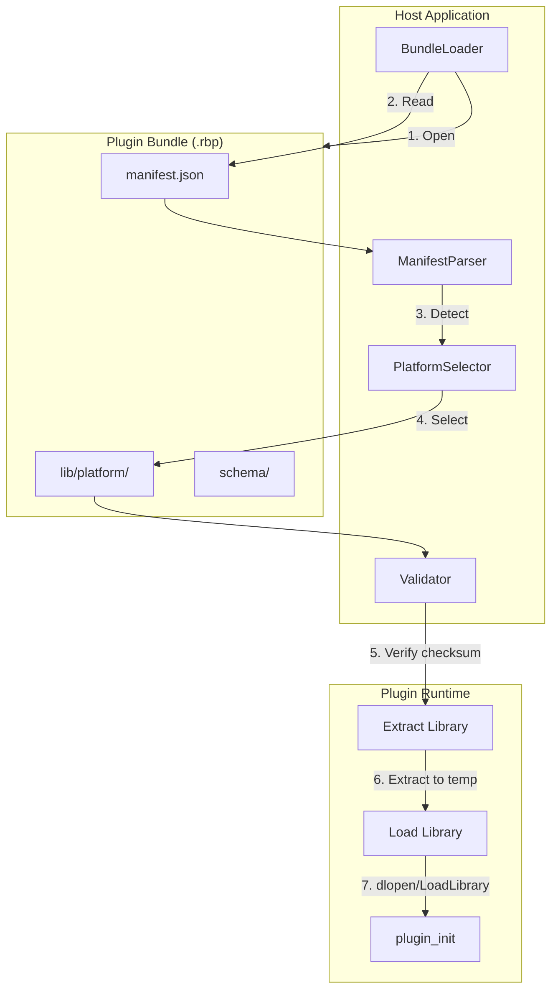
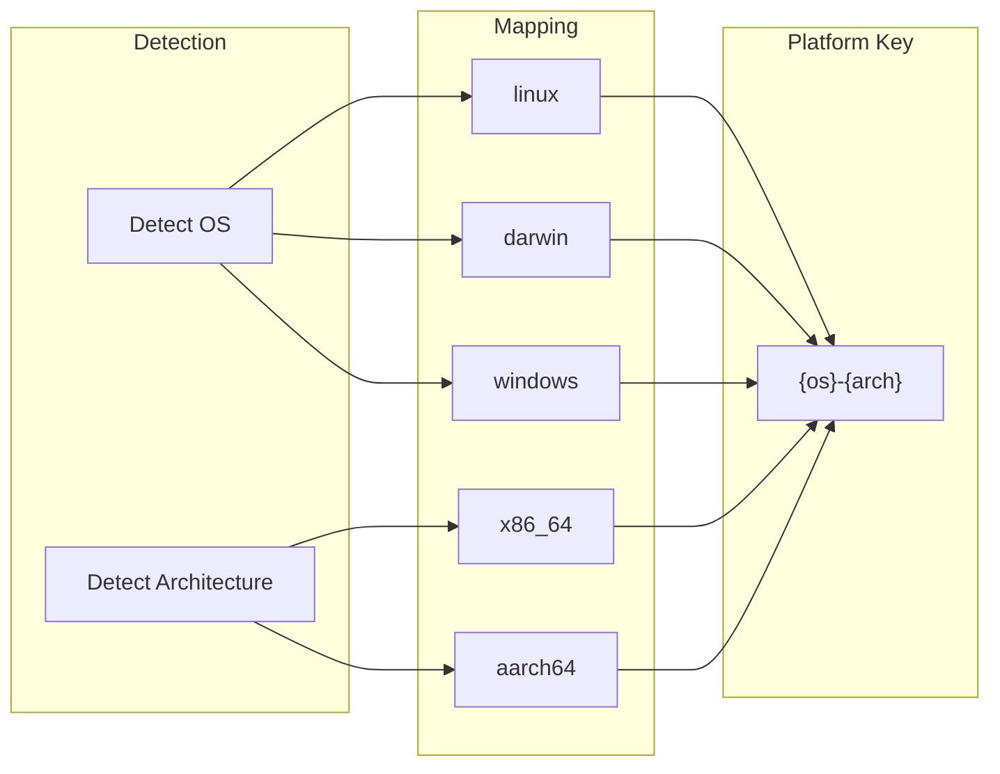
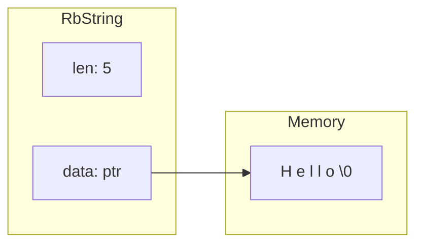
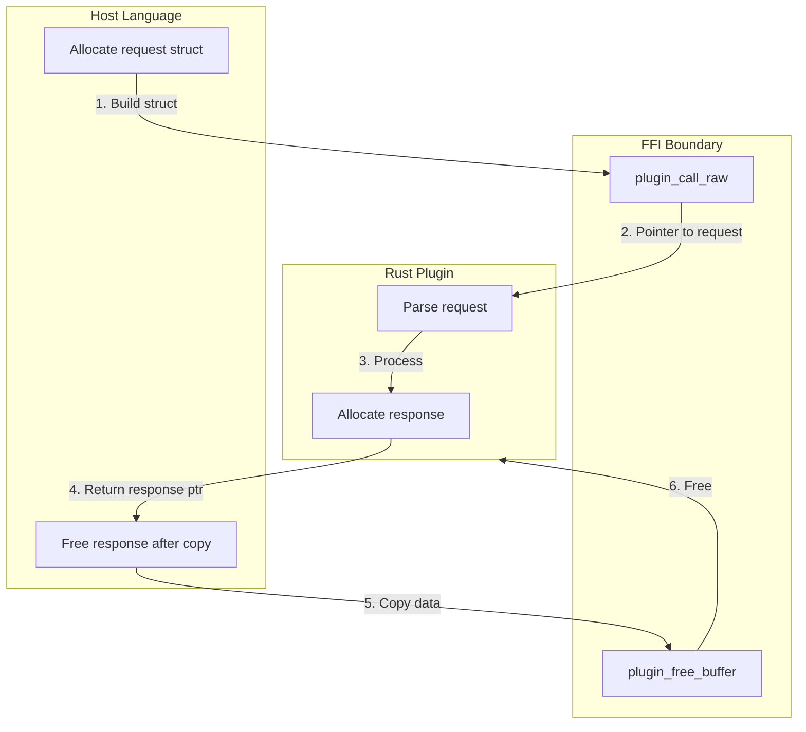
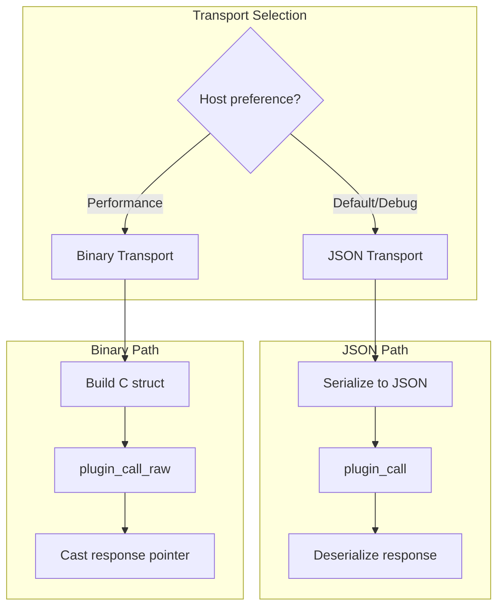

# Plugin Bundle and Binary Transport Architecture

This document describes the proposed architecture for plugin distribution bundles and the optional C struct binary transport layer.

## Overview

This proposal introduces two related features:

1. **Plugin Bundles**: A standardized `.rbp` (rustbridge plugin) archive format for distributing plugins with multi-platform support
2. **Binary Transport**: An optional C struct-based transport layer as an alternative to JSON for performance-critical use cases

These features are independent but complementary—bundles can include schema definitions for both JSON and C struct interfaces.

## Motivation

### Plugin Bundles

Currently, plugin distribution requires manual management of:
- Platform-specific shared libraries (`.so`, `.dll`, `.dylib`)
- Version compatibility
- API documentation
- Schema definitions

A standardized bundle format provides:
- Single artifact for all platforms
- Self-describing manifests
- Embedded documentation and schemas
- Simplified deployment

### Binary Transport

JSON is the primary transport for good reasons (debuggability, universal support), but some use cases benefit from binary transport:

| Use Case | JSON Overhead | Binary Benefit |
|----------|---------------|----------------|
| High-frequency calls (>10k/sec) | Parsing dominates | 10-100x faster |
| Large payloads (>1MB) | Allocation pressure | Zero-copy possible |
| Latency-sensitive paths | Microseconds matter | Nanosecond parsing |
| C/C++/Rust hosts | Double serialization | Direct struct access |

Binary transport is **opt-in** and **supplementary**—JSON remains the primary format.

## Plugin Bundle Format

### Archive Structure

```
my-plugin-1.0.0.rbp
├── manifest.json
├── schema/
│   ├── messages.json          # JSON Schema for all message types
│   ├── messages.h             # C header with struct definitions
│   └── messages.rs            # Rust type definitions (optional)
├── lib/
│   ├── linux-x86_64/
│   │   └── libmyplugin.so
│   ├── linux-aarch64/
│   │   └── libmyplugin.so
│   ├── darwin-x86_64/
│   │   └── libmyplugin.dylib
│   ├── darwin-aarch64/
│   │   └── libmyplugin.dylib
│   └── windows-x86_64/
│       └── myplugin.dll
└── docs/
    └── README.md              # Optional documentation
```

### Manifest Schema

```json
{
  "bundle_version": "1.0",
  "plugin": {
    "name": "my-plugin",
    "version": "1.0.0",
    "description": "Example plugin",
    "authors": ["Author Name <author@example.com>"],
    "license": "MIT",
    "repository": "https://github.com/example/my-plugin"
  },
  "platforms": {
    "linux-x86_64": {
      "library": "lib/linux-x86_64/libmyplugin.so",
      "checksum": "sha256:abc123..."
    },
    "linux-aarch64": {
      "library": "lib/linux-aarch64/libmyplugin.so",
      "checksum": "sha256:def456..."
    },
    "darwin-x86_64": {
      "library": "lib/darwin-x86_64/libmyplugin.dylib",
      "checksum": "sha256:..."
    },
    "darwin-aarch64": {
      "library": "lib/darwin-aarch64/libmyplugin.dylib",
      "checksum": "sha256:..."
    },
    "windows-x86_64": {
      "library": "lib/windows-x86_64/myplugin.dll",
      "checksum": "sha256:..."
    }
  },
  "api": {
    "min_rustbridge_version": "0.1.0",
    "transports": ["json", "cstruct"],
    "messages": [
      {
        "type_tag": "user.create",
        "description": "Create a new user",
        "request_schema": "schema/messages.json#/definitions/CreateUserRequest",
        "response_schema": "schema/messages.json#/definitions/CreateUserResponse",
        "cstruct_request": "CreateUserRequest",
        "cstruct_response": "CreateUserResponse"
      },
      {
        "type_tag": "user.get",
        "description": "Get user by ID",
        "request_schema": "schema/messages.json#/definitions/GetUserRequest",
        "response_schema": "schema/messages.json#/definitions/GetUserResponse",
        "cstruct_request": "GetUserRequest",
        "cstruct_response": "GetUserResponse"
      }
    ]
  },
  "dependencies": {
    "runtime": {
      "libc": ">=2.17",
      "glibc": ">=2.17"
    }
  }
}
```

### Bundle Loading Flow



### Platform Detection



Platform keys follow the pattern: `{os}-{arch}`

| OS | Architecture | Platform Key |
|----|--------------|--------------|
| Linux | x86_64 | `linux-x86_64` |
| Linux | ARM64 | `linux-aarch64` |
| macOS | x86_64 | `darwin-x86_64` |
| macOS | ARM64 | `darwin-aarch64` |
| Windows | x86_64 | `windows-x86_64` |
| Windows | ARM64 | `windows-aarch64` |

## Binary Transport Layer

### Design Principles

1. **Opt-in**: JSON remains default; binary requires explicit opt-in
2. **Documented constraints**: Clear rules for what C structs can express
3. **Header-driven**: `.h` file is the source of truth for struct layout
4. **Version-aware**: Breaking changes require version bumps

### C Struct Constraints

To ensure cross-platform compatibility, C structs must follow these rules:

#### Allowed Types

| Category | Types | Notes |
|----------|-------|-------|
| Integers | `int8_t`, `int16_t`, `int32_t`, `int64_t` | Fixed-size, signed |
| Unsigned | `uint8_t`, `uint16_t`, `uint32_t`, `uint64_t` | Fixed-size, unsigned |
| Floating | `float`, `double` | IEEE 754 |
| Boolean | `uint8_t` (0=false, 1=true) | Not `bool` (size varies) |
| Strings | `RbString` | See string handling below |
| Binary | `RbBytes` | See binary handling below |
| Arrays | `RbArray<T>` | See array handling below |
| Optional | `RbOptional<T>` | See optional handling below |

#### Forbidden Patterns

- **Bare pointers**: Use wrapper types instead
- **Unions**: Ambiguous layout
- **Bitfields**: Compiler-dependent layout
- **Flexible array members**: Size ambiguity
- **Nested pointers**: `char**`, `T***`
- **Platform-specific types**: `size_t`, `long`, `int` (use fixed-width)

### String Handling

Strings use a length-prefixed, null-terminated UTF-8 representation:

```c
typedef struct {
    uint32_t len;           // Length in bytes (excluding null terminator)
    const char* data;       // Pointer to null-terminated UTF-8 data
} RbString;
```



**Rules**:
- `data` points to valid UTF-8 bytes
- `data` is always null-terminated (for C compatibility)
- `len` is byte length, not character count
- Empty string: `len=0`, `data` points to `"\0"`
- Null/missing: `len=0`, `data=NULL`

### Binary Data Handling

Binary blobs use a pointer + length pair:

```c
typedef struct {
    uint32_t len;           // Length in bytes
    const uint8_t* data;    // Pointer to binary data
} RbBytes;
```

**Rules**:
- `data` may contain any byte values (including `0x00`)
- Empty blob: `len=0`, `data=NULL` or `data` points to valid empty buffer
- Maximum size: 2GB (uint32_t limit)

### Array Handling

Arrays use a count + pointer pattern:

```c
typedef struct {
    uint32_t count;         // Number of elements
    const T* items;         // Pointer to contiguous elements
} RbArray_T;
```

Example for an array of integers:

```c
typedef struct {
    uint32_t count;
    const int32_t* items;
} RbArrayInt32;
```

### Optional Handling

Optional values use a presence flag:

```c
typedef struct {
    uint8_t present;        // 0 = absent, 1 = present
    T value;                // Valid only if present == 1
} RbOptional_T;
```

For pointer types (strings, arrays), null pointer indicates absence:

```c
// String is optional if data can be NULL
typedef struct {
    uint32_t len;
    const char* data;       // NULL = not present
} RbString;                 // Already supports optional semantics
```

### Memory Ownership Model



**Ownership rules**:
1. **Request**: Host allocates, host frees (after call returns)
2. **Response**: Plugin allocates, host must call `plugin_free_buffer()`
3. **Nested pointers**: Follow parent's ownership

### FFI Entry Points

New entry points for binary transport:

```c
// Existing JSON-based call
FfiBuffer plugin_call(
    FfiPluginHandle handle,
    const char* type_tag,
    const uint8_t* request_json,
    size_t request_len
);

// New binary-based call
FfiBuffer plugin_call_raw(
    FfiPluginHandle handle,
    uint32_t message_id,        // Numeric message identifier
    const void* request,        // Pointer to C struct
    size_t request_size         // Size for validation
);
```

**Design decisions**:

| Aspect | JSON API | Binary API | Rationale |
|--------|----------|------------|-----------|
| Message ID | String `type_tag` | Numeric `message_id` | Faster dispatch |
| Payload | JSON bytes | Struct pointer | Zero-copy |
| Size param | Length of JSON | Struct size | Validation |
| Response | JSON in FfiBuffer | Struct in FfiBuffer | Consistent return |

### Message ID Mapping

Each message type has both a string tag and numeric ID:

```json
{
  "messages": [
    {
      "type_tag": "user.create",
      "message_id": 1,
      "cstruct_request": "CreateUserRequest",
      "cstruct_response": "CreateUserResponse"
    },
    {
      "type_tag": "user.get",
      "message_id": 2,
      "cstruct_request": "GetUserRequest",
      "cstruct_response": "GetUserResponse"
    }
  ]
}
```

### Example C Header

Generated `messages.h`:

```c
#ifndef MY_PLUGIN_MESSAGES_H
#define MY_PLUGIN_MESSAGES_H

#include <stdint.h>
#include "rustbridge_types.h"  // RbString, RbBytes, etc.

#ifdef __cplusplus
extern "C" {
#endif

// Message IDs
#define MSG_USER_CREATE  1
#define MSG_USER_GET     2

// user.create request
typedef struct {
    RbString username;          // Required, max 64 chars
    RbString email;             // Required, valid email format
    uint8_t age;                // Optional (0 = not specified)
    uint8_t is_admin;           // Boolean: 0 or 1
} CreateUserRequest;

// user.create response
typedef struct {
    uint64_t user_id;           // Assigned user ID
    int64_t created_at;         // Unix timestamp (seconds)
} CreateUserResponse;

// user.get request
typedef struct {
    uint64_t user_id;           // User ID to retrieve
} GetUserRequest;

// user.get response
typedef struct {
    uint64_t user_id;
    RbString username;
    RbString email;
    uint8_t age;
    uint8_t is_admin;
    int64_t created_at;
    int64_t updated_at;
} GetUserResponse;

#ifdef __cplusplus
}
#endif

#endif // MY_PLUGIN_MESSAGES_H
```

### Transport Selection



**Selection criteria**:

| Factor | Prefer JSON | Prefer Binary |
|--------|-------------|---------------|
| Debuggability | Yes | No |
| Cross-language | Yes | Limited |
| Schema evolution | Yes | Breaking changes |
| Performance | No | Yes |
| Payload size | Small-medium | Large |
| Call frequency | Low-medium | High |

## Integration with Existing Architecture

### Codec Trait Extension

The existing `Codec` trait in `rustbridge-transport` can support binary:

```rust
pub trait Codec: Send + Sync {
    fn encode<T: Serialize>(&self, value: &T) -> Result<Vec<u8>, CodecError>;
    fn decode<T: DeserializeOwned>(&self, bytes: &[u8]) -> Result<T, CodecError>;
    fn content_type(&self) -> &'static str;
}

// Existing
pub struct JsonCodec { ... }

// New
pub struct CStructCodec {
    // Registry of type_tag -> (encode_fn, decode_fn)
}
```

### Schema Generation Pipeline

```mermaid
flowchart LR
    subgraph Source["Source of Truth"]
        RS[Rust types with derive(Message)]
    end

    subgraph Generation["Code Generation"]
        RB[rustbridge-cli generate]
    end

    subgraph Outputs["Generated Artifacts"]
        JSON[messages.json - JSON Schema]
        CH[messages.h - C header]
        JAVA[Messages.java - Java classes]
        CS[Messages.cs - C# classes]
    end

    RS --> RB
    RB --> JSON & CH & JAVA & CS
```

### Build Integration

```bash
# Generate all artifacts
rustbridge build --bundle

# Output structure
target/bundle/
├── my-plugin-1.0.0.rbp
└── my-plugin-1.0.0/
    ├── manifest.json
    ├── schema/
    │   ├── messages.json
    │   └── messages.h
    └── lib/
        └── {platform}/
            └── {library}
```

## Implementation Phases

### Phase 1: Bundle Format (Foundation)

**Scope**:
- Define bundle archive structure
- Implement manifest schema and validation
- Add `rustbridge bundle` CLI command
- Implement bundle loading in host runtimes
- Add platform detection logic

**Deliverables**:
- `rustbridge-bundle` crate
- CLI integration
- Java/C# bundle loaders
- Documentation

### Phase 2: Schema Generation

**Scope**:
- JSON Schema generation from Rust types
- Schema embedding in bundles
- Schema validation at load time

**Deliverables**:
- `#[derive(Schema)]` macro
- JSON Schema output
- Validation integration

### Phase 3: C Struct Transport (Experimental)

**Scope**:
- C header generation
- `plugin_call_raw` FFI entry point
- Single message type for benchmarking
- Performance comparison vs JSON

**Deliverables**:
- Header generation in CLI
- FFI implementation
- Benchmark suite
- Performance documentation

### Phase 4: C Struct Transport (General)

**Scope** (conditional on Phase 3 results):
- Full C struct support for all message types
- Host language struct mapping (Java FFM, C# P/Invoke)
- Memory management utilities

**Deliverables**:
- Complete binary transport
- Host language integration
- Migration guide

## Risks and Mitigations

| Risk | Impact | Likelihood | Mitigation |
|------|--------|------------|------------|
| Binary compat breaks on struct change | High | Medium | Version fields, deprecation process |
| Platform alignment differences | Medium | Low | Explicit `#[repr(C)]` and padding |
| Complexity increase | Medium | High | Keep JSON as default, binary opt-in |
| Maintenance burden | Medium | Medium | Generate all artifacts from single source |
| Adoption confusion | Low | Medium | Clear documentation on when to use each |

## Alternatives Considered

### MessagePack Instead of C Structs

| Aspect | MessagePack | C Structs |
|--------|-------------|-----------|
| Parse speed | Fast (~10x JSON) | Instant (pointer cast) |
| Schema | Optional | Required |
| Cross-platform | Excellent | Requires care |
| Debuggability | Moderate | Low |
| Implementation | Library available | Custom code |

**Decision**: C structs offer better peak performance for the target use cases (high-frequency calls from C/C++/Rust hosts). MessagePack could be added later as a middle-ground option.

### FlatBuffers/Cap'n Proto

| Aspect | FlatBuffers | C Structs |
|--------|-------------|-----------|
| Zero-copy | Yes | Yes |
| Schema | Required | Required |
| Versioning | Built-in | Manual |
| Complexity | High | Medium |
| Dependencies | flatbuffers crate | None |

**Decision**: These add external dependencies and complexity. For the initial implementation, simple C structs provide similar performance with less cognitive overhead. Can revisit if versioning becomes painful.

## Success Criteria

### Phase 1 (Bundles)
- [ ] Single `.rbp` file deploys to all platforms
- [ ] Bundle loading works in Java, C#, Python
- [ ] Platform detection is automatic
- [ ] Checksum validation prevents tampering

### Phase 3 (Binary Transport Benchmark)
- [ ] Binary transport is 10x+ faster than JSON for benchmark message
- [ ] Memory allocations reduced by 50%+
- [ ] No safety regressions (fuzz testing passes)

### Phase 4 (General Binary)
- [ ] All message types support binary transport
- [ ] Java FFM can directly map structs
- [ ] Documentation clearly explains tradeoffs
