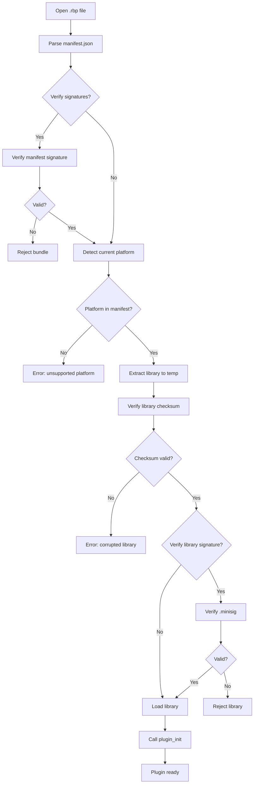

# .rbp Bundle Format Specification

This document specifies the rustbridge plugin bundle (`.rbp`) format for portable plugin distribution.

## Overview

A `.rbp` file is a ZIP archive containing:
- Multi-platform native libraries
- Manifest with metadata and checksums
- Optional schemas for message types
- Optional documentation
- Optional code signatures (minisign)

**Bundle Version**: 1.0

## Archive Structure

```
my-plugin-1.0.0.rbp
├── manifest.json                    # Required: Plugin metadata
├── manifest.json.minisig            # Optional: Manifest signature
├── lib/
│   ├── linux-x86_64/
│   │   ├── libmyplugin.so           # Native library
│   │   └── libmyplugin.so.minisig   # Optional: Library signature
│   ├── linux-aarch64/
│   │   └── libmyplugin.so
│   ├── darwin-x86_64/
│   │   └── libmyplugin.dylib
│   ├── darwin-aarch64/
│   │   └── libmyplugin.dylib
│   ├── windows-x86_64/
│   │   └── myplugin.dll
│   └── windows-aarch64/
│       └── myplugin.dll
├── schema/                          # Optional
│   ├── messages.json                # JSON Schema definitions
│   └── messages.h                   # C header for binary transport
└── docs/                            # Optional
    └── README.md
```

## Manifest Schema

The `manifest.json` file describes the bundle contents:

```json
{
  "bundle_version": "1.0",
  "plugin": {
    "name": "my-plugin",
    "version": "1.0.0",
    "description": "Example plugin description",
    "authors": ["Author Name <author@example.com>"],
    "license": "MIT",
    "repository": "https://github.com/example/my-plugin"
  },
  "public_key": "RWTxxxxxxxxxxxxxxxxxxxxxxxxxxxxxxxxxxxxxxxxxxxxxxxxxxxxxxxx",
  "platforms": {
    "linux-x86_64": {
      "library": "lib/linux-x86_64/libmyplugin.so",
      "checksum": "sha256:abc123def456..."
    },
    "linux-aarch64": {
      "library": "lib/linux-aarch64/libmyplugin.so",
      "checksum": "sha256:..."
    },
    "darwin-x86_64": {
      "library": "lib/darwin-x86_64/libmyplugin.dylib",
      "checksum": "sha256:..."
    },
    "darwin-aarch64": {
      "library": "lib/darwin-aarch64/libmyplugin.dylib",
      "checksum": "sha256:..."
    },
    "windows-x86_64": {
      "library": "lib/windows-x86_64/myplugin.dll",
      "checksum": "sha256:..."
    },
    "windows-aarch64": {
      "library": "lib/windows-aarch64/myplugin.dll",
      "checksum": "sha256:..."
    }
  },
  "api": {
    "min_rustbridge_version": "0.1.0",
    "transports": ["json", "cstruct"],
    "messages": [
      {
        "type_tag": "echo",
        "message_id": 1,
        "description": "Echo a message back",
        "transport": ["json", "cstruct"]
      },
      {
        "type_tag": "greet",
        "message_id": 2,
        "description": "Generate a greeting",
        "transport": ["json"]
      }
    ]
  },
  "schemas": {
    "json_schema": {
      "path": "schema/messages.json",
      "format": "json-schema-draft-07",
      "checksum": "sha256:..."
    },
    "c_header": {
      "path": "schema/messages.h",
      "format": "c-header",
      "checksum": "sha256:..."
    }
  }
}
```

### Required Fields

| Field | Type | Description |
|-------|------|-------------|
| `bundle_version` | string | Bundle format version (currently "1.0") |
| `plugin.name` | string | Plugin identifier (lowercase, hyphens allowed) |
| `plugin.version` | string | Semantic version (e.g., "1.0.0") |
| `platforms` | object | Map of platform keys to library info |

### Optional Fields

| Field | Type | Description |
|-------|------|-------------|
| `plugin.description` | string | Human-readable description |
| `plugin.authors` | string[] | List of authors |
| `plugin.license` | string | SPDX license identifier |
| `plugin.repository` | string | Source repository URL |
| `public_key` | string | Minisign public key for signature verification |
| `api` | object | API metadata including message definitions |
| `schemas` | object | Schema file references |

## Platform Support

### Platform Keys

Platform keys follow the pattern: `{os}-{arch}`

| Platform | Key | Library Name | Notes |
|----------|-----|--------------|-------|
| Linux x86_64 | `linux-x86_64` | `lib{name}.so` | Most common server/desktop |
| Linux ARM64 | `linux-aarch64` | `lib{name}.so` | Raspberry Pi, AWS Graviton |
| macOS Intel | `darwin-x86_64` | `lib{name}.dylib` | Older Macs |
| macOS Apple Silicon | `darwin-aarch64` | `lib{name}.dylib` | M1/M2/M3 Macs |
| Windows x64 | `windows-x86_64` | `{name}.dll` | No `lib` prefix |
| Windows ARM64 | `windows-aarch64` | `{name}.dll` | Surface Pro X, etc. |

### Library Naming Conventions

- **Unix** (Linux, macOS): Libraries use `lib` prefix: `libmyplugin.so`, `libmyplugin.dylib`
- **Windows**: No prefix: `myplugin.dll`

### Platform Detection

The bundle loader automatically detects the current platform:

```python
# Python example
platform_key = f"{os_name}-{arch}"  # e.g., "linux-x86_64"
```

```java
// Java example
String platformKey = String.format("%s-%s",
    System.getProperty("os.name").toLowerCase().contains("linux") ? "linux" : ...,
    System.getProperty("os.arch").equals("amd64") ? "x86_64" : ...
);
```

## Code Signing (Optional)

Bundles support code signing using [minisign](https://jedisct1.github.io/minisign/) for authenticity verification.

### Signature Files

| File | Signs | Purpose |
|------|-------|---------|
| `manifest.json.minisig` | `manifest.json` | Verifies manifest integrity |
| `lib/{platform}/*.minisig` | Native library | Verifies library integrity |

### Public Key in Manifest

When signing is used, the `public_key` field in the manifest contains the minisign public key:

```json
{
  "public_key": "RWTxxxxxxxxxxxxxxxxxxxxxxxxxxxxxxxxxxxxxxxxxxxxxxxxxxxxxxxx"
}
```

### Verification Modes

| Mode | Description | Use Case |
|------|-------------|----------|
| **Strict** | All signatures must be present and valid | Production |
| **Warn** | Log warnings if signatures missing | Development |
| **Skip** | Ignore signatures entirely | Testing |

### Creating Signed Bundles

```bash
# Generate a keypair (one-time)
minisign -G -s private.key -p public.key

# Sign files during bundle creation
rustbridge bundle create \
  --name my-plugin \
  --version 1.0.0 \
  --lib linux-x86_64:target/release/libmyplugin.so \
  --sign private.key \
  --output my-plugin-1.0.0.rbp
```

### Verifying Signatures

```python
# Python
loader = BundleLoader(
    bundle_path="my-plugin-1.0.0.rbp",
    verify_signatures=True  # Default
)
```

```java
// Java
BundleLoader loader = BundleLoader.builder()
    .bundlePath("my-plugin-1.0.0.rbp")
    .verifySignatures(true)  // Default
    .build();
```

## Schema Embedding

### JSON Schema

Embed JSON Schema definitions for type-safe message handling:

```json
{
  "$schema": "http://json-schema.org/draft-07/schema#",
  "definitions": {
    "EchoRequest": {
      "type": "object",
      "properties": {
        "message": { "type": "string" }
      },
      "required": ["message"]
    },
    "EchoResponse": {
      "type": "object",
      "properties": {
        "message": { "type": "string" },
        "length": { "type": "integer" }
      },
      "required": ["message", "length"]
    }
  }
}
```

### C Header

For binary transport, embed C headers with struct definitions:

```c
#ifndef MESSAGES_H
#define MESSAGES_H

#include <stdint.h>

#define MSG_ECHO 1
#define MSG_GREET 2

typedef struct {
    uint8_t version;
    uint8_t _reserved[3];
    uint8_t message[256];
    uint32_t message_len;
} EchoRequest;

typedef struct {
    uint8_t version;
    uint8_t _reserved[3];
    uint8_t message[256];
    uint32_t message_len;
    uint32_t length;
} EchoResponse;

#endif
```

## API Metadata

The `api` section describes the plugin's message interface:

### Message Definitions

```json
{
  "api": {
    "min_rustbridge_version": "0.1.0",
    "transports": ["json", "cstruct"],
    "messages": [
      {
        "type_tag": "echo",
        "message_id": 1,
        "description": "Echo a message back with its length",
        "transport": ["json", "cstruct"],
        "request_schema": "schema/messages.json#/definitions/EchoRequest",
        "response_schema": "schema/messages.json#/definitions/EchoResponse",
        "cstruct_request": "EchoRequest",
        "cstruct_response": "EchoResponse"
      }
    ]
  }
}
```

### Message Fields

| Field | Type | Description |
|-------|------|-------------|
| `type_tag` | string | JSON transport message identifier |
| `message_id` | integer | Binary transport message identifier |
| `description` | string | Human-readable description |
| `transport` | string[] | Supported transports: "json", "cstruct" |
| `request_schema` | string | JSON Schema reference for request |
| `response_schema` | string | JSON Schema reference for response |
| `cstruct_request` | string | C struct name for binary request |
| `cstruct_response` | string | C struct name for binary response |

## Bundle Loading Flow



## Creating Bundles

### Using rustbridge CLI

```bash
# Single platform
rustbridge bundle create \
  --name my-plugin \
  --version 1.0.0 \
  --lib linux-x86_64:target/release/libmyplugin.so \
  --output my-plugin-1.0.0.rbp

# Multi-platform
rustbridge bundle create \
  --name my-plugin \
  --version 1.0.0 \
  --lib linux-x86_64:target/x86_64-unknown-linux-gnu/release/libmyplugin.so \
  --lib linux-aarch64:target/aarch64-unknown-linux-gnu/release/libmyplugin.so \
  --lib darwin-x86_64:target/x86_64-apple-darwin/release/libmyplugin.dylib \
  --lib darwin-aarch64:target/aarch64-apple-darwin/release/libmyplugin.dylib \
  --lib windows-x86_64:target/x86_64-pc-windows-msvc/release/myplugin.dll \
  --schema schema/messages.json \
  --schema schema/messages.h \
  --output my-plugin-1.0.0.rbp

# With signing
rustbridge bundle create \
  --name my-plugin \
  --version 1.0.0 \
  --lib linux-x86_64:target/release/libmyplugin.so \
  --sign private.key \
  --output my-plugin-1.0.0.rbp
```

### Inspecting Bundles

```bash
# List contents
rustbridge bundle list my-plugin-1.0.0.rbp

# Output:
# Bundle: my-plugin v1.0.0
# Bundle format: v1.0
# Signed: yes (public key: RWT...)
#
# Platforms:
#   linux-x86_64:
#     Library: lib/linux-x86_64/libmyplugin.so
#     Checksum: sha256:abc123...
#     Size: 1.2 MB
#     Signature: valid
```

## Version Compatibility

### Bundle Format Versions

| Version | Changes | Min rustbridge |
|---------|---------|----------------|
| 1.0 | Initial release | 0.1.0 |

### Forward Compatibility

- Bundle loaders SHOULD ignore unknown fields in the manifest
- Bundle loaders MUST reject bundles with unsupported `bundle_version`
- Bundle loaders SHOULD warn about `min_rustbridge_version` mismatches

## Related Documentation

- [TRANSPORT.md](./TRANSPORT.md) - JSON and binary transport details
- [GETTING_STARTED.md](./GETTING_STARTED.md) - Creating your first bundle
- [CODE_GENERATION.md](./CODE_GENERATION.md) - Generating schemas
