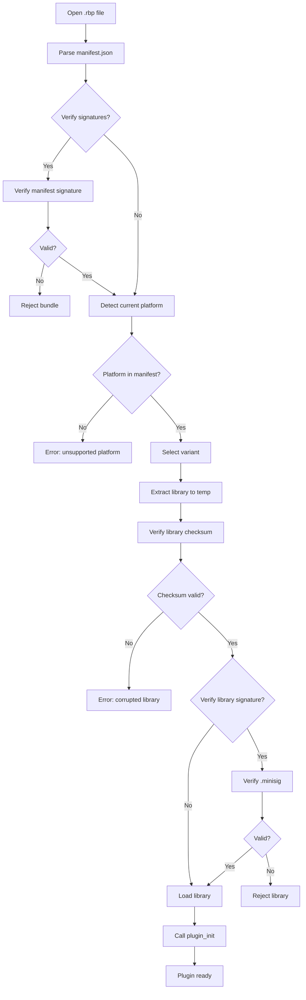

# .rbp Bundle Format Specification

This document specifies the rustbridge plugin bundle (`.rbp`) format for portable plugin distribution.

## Overview

A `.rbp` file is a ZIP archive containing:
- Multi-platform native libraries with variant support (release, debug, etc.)
- Manifest with metadata, checksums, and build information
- Optional schemas for message types
- Optional documentation and license notices
- Optional code signatures (minisign)
- Optional Software Bill of Materials (SBOM)

**Bundle Version**: 1.0

## Archive Structure

```
my-plugin-1.0.0.rbp
├── manifest.json                    # Required: Plugin metadata
├── manifest.json.minisig            # Optional: Manifest signature
├── lib/
│   ├── linux-x86_64/
│   │   ├── release/
│   │   │   ├── libmyplugin.so
│   │   │   └── libmyplugin.so.minisig
│   │   └── debug/                   # Optional variant
│   │       └── libmyplugin.so
│   ├── linux-aarch64/
│   │   └── release/
│   │       └── libmyplugin.so
│   ├── darwin-x86_64/
│   │   └── release/
│   │       └── libmyplugin.dylib
│   ├── darwin-aarch64/
│   │   └── release/
│   │       └── libmyplugin.dylib
│   ├── windows-x86_64/
│   │   └── release/
│   │       └── myplugin.dll
│   └── windows-aarch64/
│       └── release/
│           └── myplugin.dll
├── schema/                          # Optional
│   ├── messages.json
│   └── messages.h
├── legal/                           # Optional
│   └── LICENSE                      # Plugin's own license file
├── docs/                            # Optional
│   ├── README.md
│   └── NOTICES.txt
└── sbom/                            # Optional
    ├── sbom.cdx.json                # CycloneDX format
    └── sbom.spdx.json               # SPDX format
```

## Manifest Schema

The `manifest.json` file describes the bundle contents:

```json
{
  "bundle_version": "1.0",
  "plugin": {
    "name": "my-plugin",
    "version": "1.0.0",
    "description": "Example plugin description",
    "authors": ["Author Name <author@example.com>"],
    "license": "MIT",
    "repository": "https://github.com/example/my-plugin"
  },
  "platforms": {
    "linux-x86_64": {
      "variants": {
        "release": {
          "library": "lib/linux-x86_64/release/libmyplugin.so",
          "checksum": "sha256:abc123def456...",
          "build": {
            "profile": "release",
            "opt_level": "3",
            "features": ["json", "binary"]
          }
        },
        "debug": {
          "library": "lib/linux-x86_64/debug/libmyplugin.so",
          "checksum": "sha256:789xyz...",
          "build": {
            "profile": "debug",
            "opt_level": "0"
          }
        }
      }
    },
    "darwin-aarch64": {
      "variants": {
        "release": {
          "library": "lib/darwin-aarch64/release/libmyplugin.dylib",
          "checksum": "sha256:..."
        }
      }
    }
  },
  "build_info": {
    "built_by": "GitHub Actions",
    "built_at": "2025-01-26T10:30:00Z",
    "host": "x86_64-unknown-linux-gnu",
    "compiler": "rustc 1.90.0",
    "rustbridge_version": "0.2.0",
    "git": {
      "commit": "a1b2c3d4e5f6",
      "branch": "main",
      "tag": "v1.0.0",
      "dirty": false
    },
    "custom": {
      "repository": "https://github.com/example/my-plugin",
      "ci_job_id": "12345"
    }
  },
  "sbom": {
    "cyclonedx": "sbom/sbom.cdx.json",
    "spdx": "sbom/sbom.spdx.json"
  },
  "schema_checksum": "sha256:combined_hash_of_all_schemas",
  "notices": "docs/NOTICES.txt",
  "license_file": "legal/LICENSE",
  "public_key": "RWTxxxxxxxxxxxxxxxxxxxxxxxxxxxxxxxxxxxxxxxxxxxxxxxxxxxxxxxx",
  "api": {
    "min_rustbridge_version": "0.5.0",
    "transports": ["json", "cstruct"],
    "messages": [...]
  },
  "schemas": {
    "json_schema": {
      "path": "schema/messages.json",
      "format": "json-schema-draft-07",
      "checksum": "sha256:..."
    }
  }
}
```

## Variants

Each platform contains one or more **variants** of the native library. This allows a single bundle to include release builds, debug builds, builds with different feature flags, or builds from different compilers.

### Variant Rules

| Rule | Description |
|------|-------------|
| `release` is mandatory | Every platform must have a `release` variant |
| `release` is the default | Loaders use `release` unless explicitly told otherwise |
| Other variants are optional | Add `debug`, `nightly`, `opt-size`, etc. as needed |
| Variant names | Lowercase alphanumeric with hyphens (e.g., `release`, `debug`, `nightly-experimental`) |

### Variant Structure

Each variant contains:

| Field | Required | Description |
|-------|----------|-------------|
| `library` | Yes | Relative path to the library within the bundle |
| `checksum` | Yes | SHA256 checksum (format: `sha256:hexdigest`) |
| `build` | No | Build metadata (flexible JSON object) |

### Build Metadata (Flexible Schema)

The `build` field accepts **any JSON object** to support different toolchains:

```json
{
  "variants": {
    "release": {
      "library": "lib/linux-x86_64/release/libplugin.so",
      "checksum": "sha256:...",
      "build": {
        "profile": "release",
        "opt_level": "3",
        "features": ["json", "binary"],
        "lto": true
      }
    }
  }
}
```

**For Rust projects**, common fields include:
- `profile` - Build profile (release, debug)
- `opt_level` - Optimization level (0, 1, 2, 3, s, z)
- `features` - Enabled cargo features
- `lto` - Link-time optimization enabled

**For Go projects**:
- `go_version` - Go compiler version
- `go_tags` - Build tags
- `cgo` - CGO enabled

**For C/C++ projects**:
- `compiler` - Compiler used (gcc, clang, msvc)
- `cflags` - Compiler flags
- `ldflags` - Linker flags

**For any project**:
- `notes` - Freeform build notes

## Build Information

The optional `build_info` section provides traceability for the bundle:

```json
{
  "build_info": {
    "built_by": "GitHub Actions",
    "built_at": "2025-01-26T10:30:00Z",
    "host": "x86_64-unknown-linux-gnu",
    "compiler": "rustc 1.90.0",
    "rustbridge_version": "0.2.0",
    "git": {
      "commit": "a1b2c3d4e5f6789012345678901234567890abcd",
      "branch": "main",
      "tag": "v1.0.0",
      "dirty": false
    }
  }
}
```

### Build Info Fields

| Field | Required | Description |
|-------|----------|-------------|
| `built_by` | No | Builder identity (username, CI system) |
| `built_at` | No | Build timestamp (ISO 8601) |
| `host` | No | Host platform that built the bundle |
| `compiler` | No | Compiler version |
| `rustbridge_version` | No | rustbridge CLI version used |
| `git` | No | Git repository information |
| `custom` | No | Arbitrary key/value metadata (see below) |

### Custom Metadata

The `custom` field accepts arbitrary key/value pairs for informational purposes:

```json
{
  "build_info": {
    "custom": {
      "repository": "https://github.com/example/my-plugin",
      "ci_job_id": "12345",
      "pipeline": "release"
    }
  }
}
```

Use this for data that rustbridge can't automatically detect, such as:
- Source repository URL (git remotes aren't captured automatically)
- CI/CD job identifiers
- Custom build tags or labels

Add custom metadata with the `--metadata` flag:

```bash
rustbridge bundle create \
  --name my-plugin --version 1.0.0 \
  --lib linux-x86_64:target/release/libmyplugin.so \
  --metadata repository=https://github.com/example/my-plugin \
  --metadata ci_job_id=12345 \
  --output my-plugin-1.0.0.rbp
```

### Git Information

The `git` section is **optional** - omit it entirely if not using git:

| Field | Required | Description |
|-------|----------|-------------|
| `commit` | Yes* | Full or short commit hash (*required if `git` section present) |
| `branch` | No | Branch name |
| `tag` | No | Git tag if on a tagged commit |
| `dirty` | No | `true` if working directory had uncommitted changes |

## Software Bill of Materials (SBOM)

Bundles can include SBOM files for dependency transparency:

```json
{
  "sbom": {
    "cyclonedx": "sbom/sbom.cdx.json",
    "spdx": "sbom/sbom.spdx.json"
  }
}
```

Both formats can be included simultaneously. Supported formats:
- **CycloneDX** 1.5 (JSON) - `sbom/sbom.cdx.json`
- **SPDX** 2.3 (JSON) - `sbom/sbom.spdx.json`

## License Files

Bundles support two types of license files:

| Field | Path | Purpose |
|-------|------|---------|
| `notices` | `docs/NOTICES.txt` | Third-party attribution (Apache NOTICE-style) |
| `license_file` | `legal/LICENSE` | Plugin's own license text |

### Plugin License

Include your plugin's license file with `--license`:

```bash
rustbridge bundle create \
  --name my-plugin --version 1.0.0 \
  --lib linux-x86_64:target/release/libmyplugin.so \
  --license LICENSE \
  --output my-plugin-1.0.0.rbp
```

The manifest records the path:

```json
{
  "license_file": "legal/LICENSE"
}
```

### Third-Party Notices

Include attribution notices with `--notices`:

```bash
rustbridge bundle create \
  --name my-plugin --version 1.0.0 \
  --lib linux-x86_64:target/release/libmyplugin.so \
  --notices NOTICES.txt \
  --output my-plugin-1.0.0.rbp
```

## Schema Checksum

The `schema_checksum` field contains a combined hash of all schema files, used to verify schema compatibility when combining bundles:

```json
{
  "schema_checksum": "sha256:abc123..."
}
```

This checksum is computed by hashing the concatenation of all schema file checksums in sorted order.

## Required Fields

| Field | Type | Description |
|-------|------|-------------|
| `bundle_version` | string | Bundle format version (currently "1.0") |
| `plugin.name` | string | Plugin identifier (lowercase, hyphens allowed) |
| `plugin.version` | string | Semantic version (e.g., "1.0.0") |
| `platforms` | object | Map of platform keys to variant info |
| `platforms.{key}.variants.release` | object | Release variant (mandatory for each platform) |

## Optional Fields

| Field | Type | Description |
|-------|------|-------------|
| `plugin.description` | string | Human-readable description |
| `plugin.authors` | string[] | List of authors |
| `plugin.license` | string | SPDX license identifier |
| `plugin.repository` | string | Source repository URL |
| `build_info` | object | Build metadata and provenance |
| `sbom` | object | Paths to SBOM files |
| `schema_checksum` | string | Combined hash of schema files |
| `notices` | string | Path to third-party license notices file |
| `license_file` | string | Path to the plugin's own license file |
| `public_key` | string | Minisign public key for signature verification |
| `api` | object | API metadata including message definitions |
| `schemas` | object | Schema file references |

## Platform Support

### Platform Keys

Platform keys follow the pattern: `{os}-{arch}`

| Platform | Key | Library Name | Notes |
|----------|-----|--------------|-------|
| Linux x86_64 | `linux-x86_64` | `lib{name}.so` | Most common server/desktop |
| Linux ARM64 | `linux-aarch64` | `lib{name}.so` | Raspberry Pi, AWS Graviton |
| macOS Intel | `darwin-x86_64` | `lib{name}.dylib` | Older Macs |
| macOS Apple Silicon | `darwin-aarch64` | `lib{name}.dylib` | M1/M2/M3 Macs |
| Windows x64 | `windows-x86_64` | `{name}.dll` | No `lib` prefix |
| Windows ARM64 | `windows-aarch64` | `{name}.dll` | Surface Pro X, etc. |

### Library Naming Conventions

- **Unix** (Linux, macOS): Libraries use `lib` prefix: `libmyplugin.so`, `libmyplugin.dylib`
- **Windows**: No prefix: `myplugin.dll`

### Platform Detection

The bundle loader automatically detects the current platform:

```python
# Python example
platform_key = f"{os_name}-{arch}"  # e.g., "linux-x86_64"
```

```java
// Java example
String platformKey = String.format("%s-%s",
    System.getProperty("os.name").toLowerCase().contains("linux") ? "linux" : ...,
    System.getProperty("os.arch").equals("amd64") ? "x86_64" : ...
);
```

## Code Signing (Optional)

Bundles support code signing using [minisign](https://jedisct1.github.io/minisign/) for authenticity verification.

### Signature Files

| File | Signs | Purpose |
|------|-------|---------|
| `manifest.json.minisig` | `manifest.json` | Verifies manifest integrity |
| `lib/{platform}/{variant}/*.minisig` | Native library | Verifies library integrity |

### Public Key in Manifest

When signing is used, the `public_key` field in the manifest contains the minisign public key:

```json
{
  "public_key": "RWTxxxxxxxxxxxxxxxxxxxxxxxxxxxxxxxxxxxxxxxxxxxxxxxxxxxxxxxx"
}
```

### Verification Modes

| Mode | Description | Use Case |
|------|-------------|----------|
| **Strict** | All signatures must be present and valid | Production |
| **Warn** | Log warnings if signatures missing | Development |
| **Skip** | Ignore signatures entirely | Testing |

### Creating Signed Bundles

```bash
# Generate a keypair (one-time)
rustbridge keygen --output signing.key

# Sign files during bundle creation
rustbridge bundle create \
  --name my-plugin \
  --version 1.0.0 \
  --lib linux-x86_64:target/release/libmyplugin.so \
  --sign-key signing.key \
  --output my-plugin-1.0.0.rbp
```

### Verifying Signatures

```python
# Python - verification enabled by default
plugin = BundleLoader.load("my-plugin-1.0.0.rbp")

# Disable verification (testing only)
plugin = BundleLoader.load("my-plugin-1.0.0.rbp", verify_signatures=False)
```

```java
// Java - verification enabled by default
Plugin plugin = BundleLoader.load("my-plugin-1.0.0.rbp");

// Disable verification (testing only)
Plugin plugin = BundleLoader.load("my-plugin-1.0.0.rbp", false);
```

## Schema Embedding

### JSON Schema

Embed JSON Schema definitions for type-safe message handling:

```json
{
  "$schema": "http://json-schema.org/draft-07/schema#",
  "definitions": {
    "EchoRequest": {
      "type": "object",
      "properties": {
        "message": { "type": "string" }
      },
      "required": ["message"]
    },
    "EchoResponse": {
      "type": "object",
      "properties": {
        "message": { "type": "string" },
        "length": { "type": "integer" }
      },
      "required": ["message", "length"]
    }
  }
}
```

### C Header

For binary transport, embed C headers with struct definitions:

```c
#ifndef MESSAGES_H
#define MESSAGES_H

#include <stdint.h>

#define MSG_ECHO 1
#define MSG_GREET 2

typedef struct {
    uint8_t version;
    uint8_t _reserved[3];
    uint8_t message[256];
    uint32_t message_len;
} EchoRequest;

typedef struct {
    uint8_t version;
    uint8_t _reserved[3];
    uint8_t message[256];
    uint32_t message_len;
    uint32_t length;
} EchoResponse;

#endif
```

## API Metadata

The `api` section describes the plugin's message interface:

### Message Definitions

```json
{
  "api": {
    "min_rustbridge_version": "0.5.0",
    "transports": ["json", "cstruct"],
    "messages": [
      {
        "type_tag": "echo",
        "message_id": 1,
        "description": "Echo a message back with its length",
        "transport": ["json", "cstruct"],
        "request_schema": "schema/messages.json#/definitions/EchoRequest",
        "response_schema": "schema/messages.json#/definitions/EchoResponse",
        "cstruct_request": "EchoRequest",
        "cstruct_response": "EchoResponse"
      }
    ]
  }
}
```

### Message Fields

| Field | Type | Description |
|-------|------|-------------|
| `type_tag` | string | JSON transport message identifier |
| `message_id` | integer | Binary transport message identifier |
| `description` | string | Human-readable description |
| `transport` | string[] | Supported transports: "json", "cstruct" |
| `request_schema` | string | JSON Schema reference for request |
| `response_schema` | string | JSON Schema reference for response |
| `cstruct_request` | string | C struct name for binary request |
| `cstruct_response` | string | C struct name for binary response |

## Bundle Loading Flow



## Creating Bundles

### Using rustbridge CLI

```bash
# Single platform, release only (default)
rustbridge bundle create \
  --name my-plugin \
  --version 1.0.0 \
  --lib linux-x86_64:target/release/libmyplugin.so \
  --output my-plugin-1.0.0.rbp

# With debug variant
rustbridge bundle create \
  --name my-plugin \
  --version 1.0.0 \
  --lib linux-x86_64:release:target/release/libmyplugin.so \
  --lib linux-x86_64:debug:target/debug/libmyplugin.so \
  --output my-plugin-1.0.0.rbp

# Multi-platform with SBOM
rustbridge bundle create \
  --name my-plugin \
  --version 1.0.0 \
  --lib linux-x86_64:target/x86_64-unknown-linux-gnu/release/libmyplugin.so \
  --lib darwin-aarch64:target/aarch64-apple-darwin/release/libmyplugin.dylib \
  --lib windows-x86_64:target/x86_64-pc-windows-msvc/release/myplugin.dll \
  --schema schema/messages.json \
  --sbom cyclonedx,spdx \
  --notices NOTICES.txt \
  --sign-key signing.key \
  --output my-plugin-1.0.0.rbp
```

### Combining Bundles

Merge multiple single-platform bundles into one multi-platform bundle:

```bash
rustbridge bundle combine \
  --output combined.rbp \
  --sign-key signing.key \
  linux-only.rbp macos-only.rbp windows-only.rbp
```

Schema validation is enforced by default (error if `schema_checksum` differs):

```bash
# Warn instead of error
rustbridge bundle combine --schema-mismatch warn ...

# Skip schema check
rustbridge bundle combine --schema-mismatch ignore ...
```

### Slimming Bundles

Extract a subset of platforms/variants from a larger bundle:

```bash
rustbridge bundle slim \
  --input developer.rbp \
  --output production.rbp \
  --platforms linux-x86_64,darwin-aarch64 \
  --variants release \
  --exclude-docs \
  --sign-key signing.key
```

### Inspecting Bundles

```bash
# List contents
rustbridge bundle list my-plugin-1.0.0.rbp

# Detailed info with build metadata
rustbridge bundle info --show-build --show-variants my-plugin-1.0.0.rbp

# JSON output for scripting
rustbridge bundle info --json my-plugin-1.0.0.rbp
```

## Loading Bundles

### Default Behavior

All loaders automatically select the `release` variant:

```python
# Python
plugin = BundleLoader.load("plugin.rbp")
```

```java
// Java
Plugin plugin = BundleLoader.load("plugin.rbp");
```

```csharp
// C#
var plugin = BundleLoader.Load("plugin.rbp");
```

### Selecting a Variant

To load a specific variant (e.g., debug):

```python
# Python
plugin = BundleLoader.load("plugin.rbp", variant="debug")
```

```java
// Java
Plugin plugin = BundleLoader.load("plugin.rbp", "debug");
```

```csharp
// C#
var plugin = BundleLoader.Load("plugin.rbp", variant: "debug");
```

### Listing Available Variants

```python
# Python
variants = BundleLoader.list_variants("plugin.rbp", "linux-x86_64")
# Returns: ["release", "debug"]
```

```java
// Java
List<String> variants = BundleLoader.listVariants("plugin.rbp", "linux-x86_64");
```

## For Non-Rust Developers

The `.rbp` bundle format is language-agnostic. You can create bundles manually or with tooling in any language.

### Manual Bundle Creation

1. Create a ZIP archive with the required structure
2. Write a `manifest.json` with at least:
   - `bundle_version`: `"1.0"`
   - `plugin.name` and `plugin.version`
   - `platforms` with at least one platform containing a `release` variant
3. Compute SHA256 checksums for each library
4. Optionally sign with minisign

### Required FFI Symbols

Your shared library must export these C-ABI symbols:

| Symbol | Signature | Description |
|--------|-----------|-------------|
| `plugin_init` | `fn(*const PluginConfig) -> i32` | Initialize plugin |
| `plugin_shutdown` | `fn() -> i32` | Shutdown plugin |
| `plugin_send` | `fn(*const u8, usize, *mut FfiBuffer) -> i32` | Send message |
| `plugin_free_buffer` | `fn(*mut FfiBuffer)` | Free response buffer |

See [FFI.md](./FFI.md) for detailed type definitions.

### Example: Go Plugin

```go
package main

import "C"

//export plugin_init
func plugin_init(config *C.PluginConfig) C.int {
    // Initialize
    return 0
}

//export plugin_shutdown
func plugin_shutdown() C.int {
    // Cleanup
    return 0
}

// ... other exports
```

Build and package:

```bash
go build -buildmode=c-shared -o libmyplugin.so

# Create manifest.json manually
# Compute checksum: sha256sum libmyplugin.so
# Create ZIP archive with correct structure
```

## Version Compatibility

### Bundle Format Versions

| Version | Changes | Min rustbridge |
|---------|---------|----------------|
| 1.0 | Multi-variant support, build_info, SBOM, schema_checksum | 0.2.0 |

### Forward Compatibility

- Bundle loaders SHOULD ignore unknown fields in the manifest
- Bundle loaders MUST reject bundles with unsupported `bundle_version`
- Bundle loaders SHOULD warn about `min_rustbridge_version` mismatches

## Related Documentation

- [TRANSPORT.md](./TRANSPORT.md) - JSON and binary transport details
- [GETTING_STARTED.md](./GETTING_STARTED.md) - Creating your first bundle
- [MEMORY_MODEL.md](./MEMORY_MODEL.md) - Memory ownership patterns
