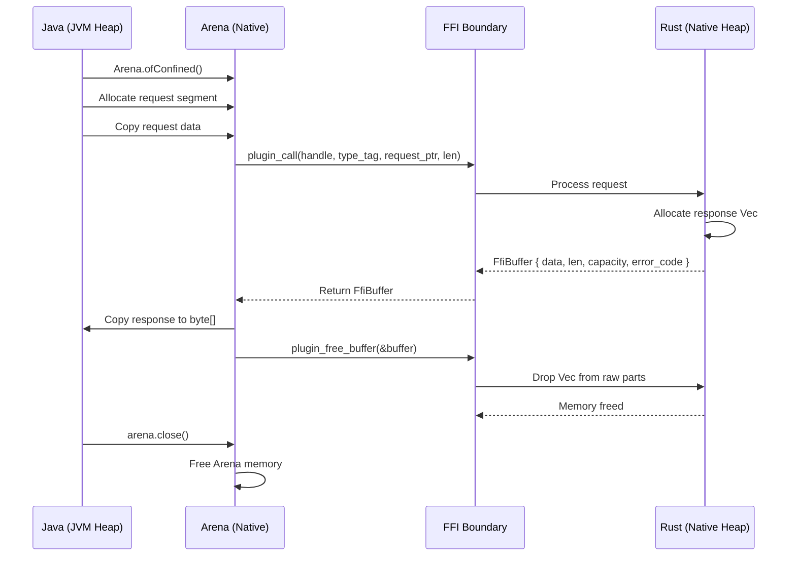
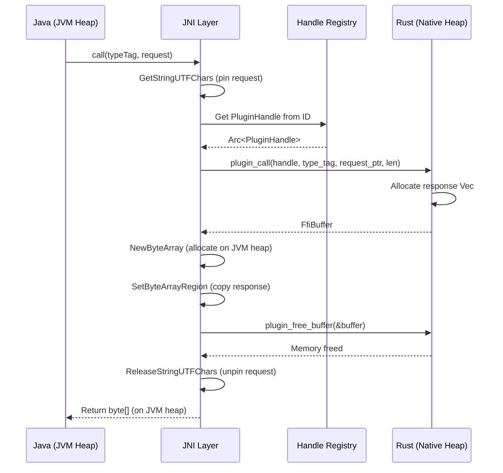
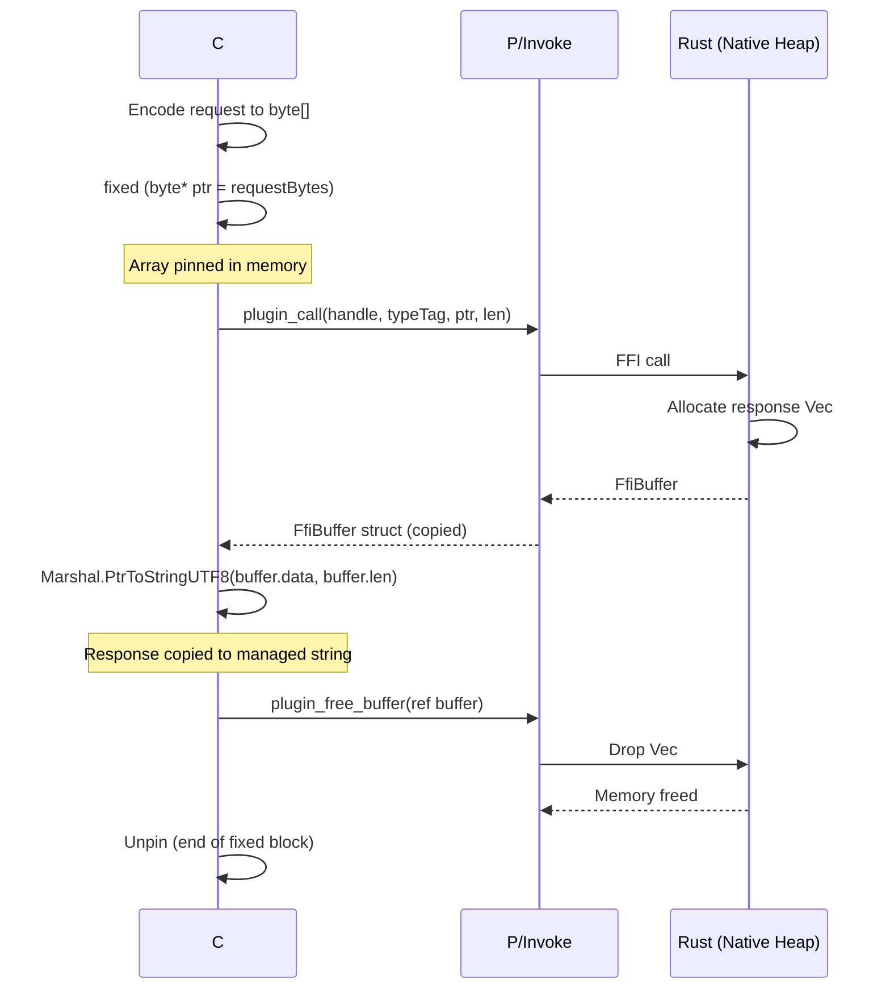
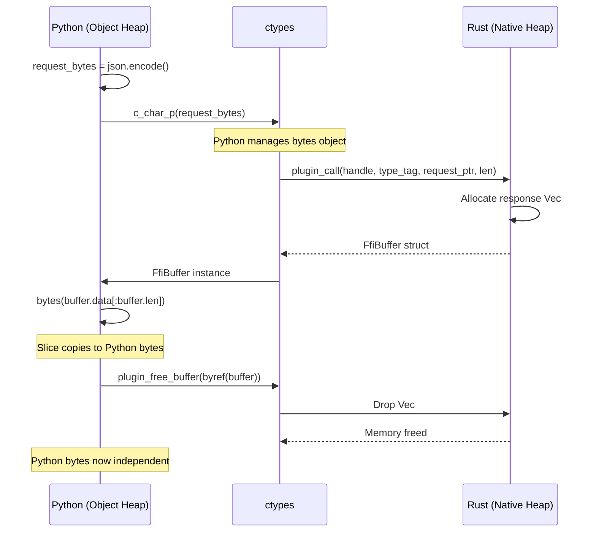
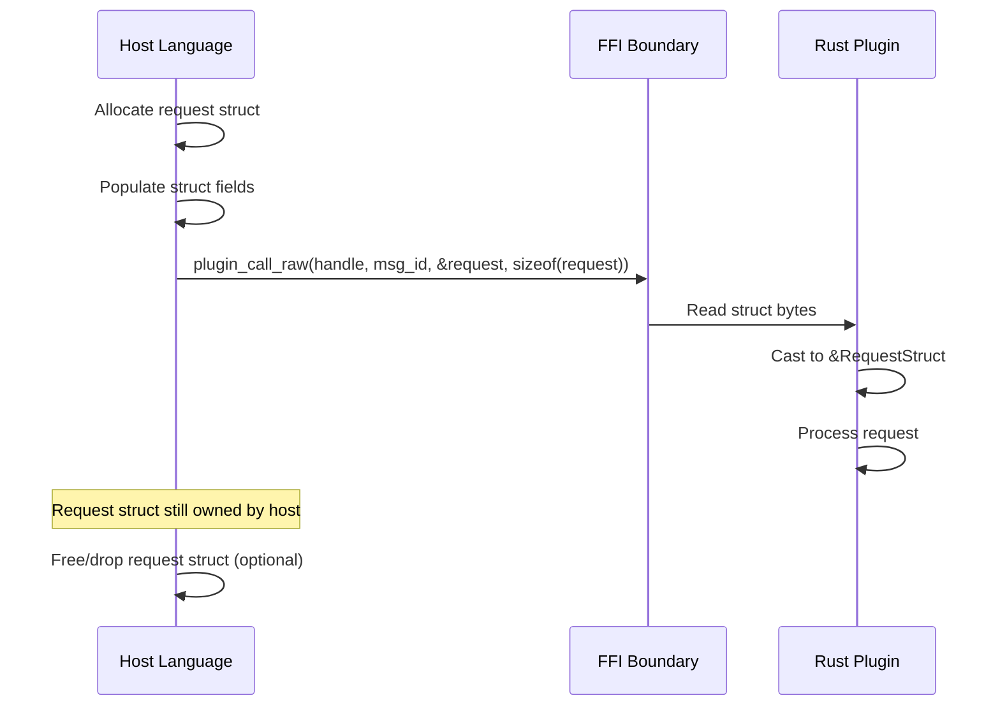
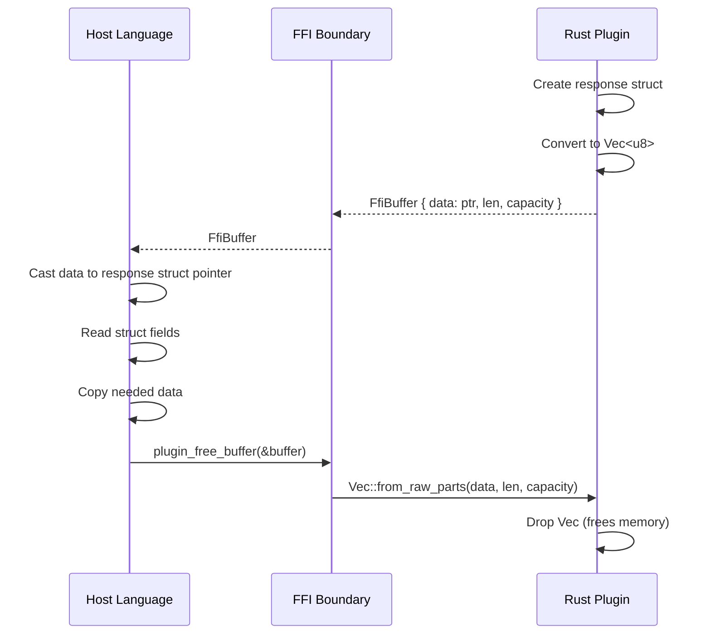

# Memory Model

This document describes the memory ownership patterns in rustbridge, including how memory flows across the FFI boundary for each supported language.

## Core Principle

rustbridge follows a **"Rust allocates, host frees"** pattern:

1. Host prepares request data in its managed memory
2. Host calls FFI function, passing pointer to request
3. Rust processes request and allocates response buffer
4. Rust returns `FfiBuffer` containing response pointer
5. Host copies response data to managed memory
6. Host calls `plugin_free_buffer()` to release Rust memory

This pattern ensures:
- Clear ownership at every step
- No double-free or use-after-free
- Predictable memory lifecycle
- Safe cleanup even on errors

## FfiBuffer Structure

All FFI responses use the `FfiBuffer` structure:

```rust
#[repr(C)]
pub struct FfiBuffer {
    /// Pointer to Rust-allocated data
    pub data: *mut u8,
    /// Data length in bytes
    pub len: usize,
    /// Allocation capacity (for Vec recreation)
    pub capacity: usize,
    /// Error code: 0 = success, non-zero = error
    pub error_code: u32,
}
```

```c
// C equivalent
typedef struct {
    uint8_t* data;
    size_t len;
    size_t capacity;
    uint32_t error_code;
} FfiBuffer;
```

## Memory Flow by Language

### Java FFM (Java 21+)

FFM uses Arena-based memory management with automatic cleanup.



**Key Points:**
- Arena manages native memory lifecycle
- Response data copied to JVM heap before freeing
- `arena.close()` releases all Arena allocations
- Try-with-resources ensures cleanup

**Code Example:**
```java
try (Arena arena = Arena.ofConfined()) {
    // Allocate and copy request
    MemorySegment request = arena.allocateFrom(jsonBytes);

    // Call plugin
    FfiBuffer response = nativeBindings.pluginCall(
        handle, typeTag, request, jsonBytes.length);

    try {
        if (response.errorCode() != 0) {
            throw new PluginException(response.errorCode(), ...);
        }
        // Copy to JVM heap before freeing
        byte[] result = response.data()
            .reinterpret(response.len())
            .toArray(ValueLayout.JAVA_BYTE);
        return new String(result, StandardCharsets.UTF_8);
    } finally {
        nativeBindings.pluginFreeBuffer(response);
    }
}
// Arena cleanup happens here
```

### Java JNI (Java 17+)

JNI uses explicit memory management with reference tracking.



**Key Points:**
- JNI pins strings during native calls
- Response copied to JVM heap immediately
- Arc reference counting for handle safety
- All native memory freed before returning

**Code Example (JNI Implementation):**
```c
JNIEXPORT jbyteArray JNICALL Java_com_rustbridge_jni_JniPlugin_call(
    JNIEnv *env, jobject obj, jstring typeTag, jbyteArray request) {

    // Pin Java strings/arrays
    const char *typeTagChars = (*env)->GetStringUTFChars(env, typeTag, NULL);
    jsize requestLen = (*env)->GetArrayLength(env, request);
    jbyte *requestBytes = (*env)->GetByteArrayElements(env, request, NULL);

    // Call Rust
    FfiBuffer response = plugin_call(handle, typeTagChars,
                                     (uint8_t*)requestBytes, requestLen);

    // Unpin request immediately
    (*env)->ReleaseByteArrayElements(env, request, requestBytes, JNI_ABORT);
    (*env)->ReleaseStringUTFChars(env, typeTag, typeTagChars);

    if (response.error_code != 0) {
        // Free response and throw
        plugin_free_buffer(&response);
        throwPluginException(env, response.error_code);
        return NULL;
    }

    // Copy to JVM heap
    jbyteArray result = (*env)->NewByteArray(env, response.len);
    (*env)->SetByteArrayRegion(env, result, 0, response.len, response.data);

    // Free native memory
    plugin_free_buffer(&response);

    return result;
}
```

### C# (.NET)

C# uses P/Invoke with `fixed` statements and `Marshal` for safe memory handling.



**Key Points:**
- `fixed` statement pins managed arrays during FFI
- `Marshal` methods copy data to managed heap
- FfiBuffer struct is copied (blittable)
- Native memory freed explicitly

**Code Example:**
```csharp
public string Call(string typeTag, string request)
{
    byte[] requestBytes = Encoding.UTF8.GetBytes(request);
    FfiBuffer buffer;

    unsafe
    {
        fixed (byte* requestPtr = requestBytes)
        {
            buffer = NativeBindings.plugin_call(
                _handle,
                typeTag,
                requestPtr,
                (nuint)requestBytes.Length);
        }
    }

    try
    {
        if (buffer.ErrorCode != 0)
        {
            throw new PluginException(buffer.ErrorCode, ...);
        }

        // Copy to managed string
        return Marshal.PtrToStringUTF8(buffer.Data, (int)buffer.Len)
            ?? string.Empty;
    }
    finally
    {
        NativeBindings.plugin_free_buffer(ref buffer);
    }
}
```

### Python (ctypes)

Python uses ctypes for FFI with automatic memory management through garbage collection.



**Key Points:**
- ctypes handles type conversion automatically
- Python bytes objects are immutable, require copy
- Slice notation `data[:len]` copies data
- `byref()` passes struct by reference

**Code Example:**
```python
def call(self, type_tag: str, request: str) -> str:
    """Make a JSON call to the plugin."""
    request_bytes = request.encode('utf-8')

    # Call FFI
    buffer = self._lib.plugin_call(
        self._handle,
        type_tag.encode('utf-8'),
        request_bytes,
        len(request_bytes)
    )

    try:
        if buffer.error_code != 0:
            raise PluginException(buffer.error_code, ...)

        # Copy response to Python bytes
        response_bytes = bytes(buffer.data[:buffer.len])
        return response_bytes.decode('utf-8')

    finally:
        # Free native memory
        self._lib.plugin_free_buffer(ctypes.byref(buffer))
```

## Binary Transport Memory

Binary transport follows similar patterns but with struct pointers.

### Request Memory (Host-Owned)



### Response Memory (Rust-Owned)



## Callback Memory

Log callbacks require special handling to prevent garbage collection.

### Java Callbacks

```java
// Java side - prevent GC
private final LogCallback callback;  // Store reference

// In plugin initialization
this.callback = (level, target, message) -> {
    logger.log(level, "[{}] {}", target, message);
};

// Pass to native code
plugin.setLogCallback(callback);
```

### C# Callbacks

```csharp
// C# side - prevent GC
private readonly GCHandle _callbackHandle;
private readonly LogCallbackDelegate _callback;

public NativePlugin(string libraryPath)
{
    _callback = OnLog;
    _callbackHandle = GCHandle.Alloc(_callback);  // Pin delegate

    // Pass to native code
    NativeBindings.plugin_init(..., _callback);
}

public void Dispose()
{
    // Release pin when done
    _callbackHandle.Free();
}
```

### Python Callbacks

```python
class NativePlugin:
    def __init__(self, library_path: str):
        # Store callback reference to prevent GC
        self._log_callback = CFUNCTYPE(None, c_uint8, c_char_p, c_char_p, c_size_t)(
            self._on_log
        )

        # Pass to native code
        self._lib.plugin_init(..., self._log_callback)

    def _on_log(self, level: int, target: bytes, message: bytes, msg_len: int):
        # Handle log message
        pass
```

## Memory Safety Rules

### For Host Language Implementers

1. **Always free buffers** - Call `plugin_free_buffer()` after reading response
2. **Copy before free** - Copy response data to managed heap before freeing
3. **No concurrent access** - FfiBuffer operations are not thread-safe
4. **Pin callbacks** - Prevent GC of callback functions during plugin lifetime
5. **Handle errors** - Free buffers even on error paths

### For Plugin Implementers

1. **Never return stack pointers** - Response data must be heap-allocated
2. **Use Vec for responses** - Let rustbridge convert to FfiBuffer
3. **No static mut** - Avoid mutable statics for response data
4. **Clear on shutdown** - Release all resources in `on_stop()`

## Debugging Memory Issues

### Common Issues

| Issue | Symptom | Cause | Fix |
|-------|---------|-------|-----|
| Double free | Crash/corruption | Calling free twice | Track freed buffers |
| Use after free | Garbage data | Reading after free | Copy before free |
| Memory leak | Growing memory | Missing free call | Add finally/dispose |
| Dangling callback | Crash on log | GC'd callback | Pin callback reference |

### Tools

- **Valgrind** (Linux): Memory leak detection
- **AddressSanitizer**: Use-after-free detection
- **heaptrack** (Linux): Memory profiling
- **dotMemory** (.NET): Managed heap analysis

## Related Documentation

- [TRANSPORT.md](./TRANSPORT.md) - Transport layer details
- [ARCHITECTURE.md](./ARCHITECTURE.md) - System architecture
- [DEBUGGING.md](./DEBUGGING.md) - Debugging techniques
