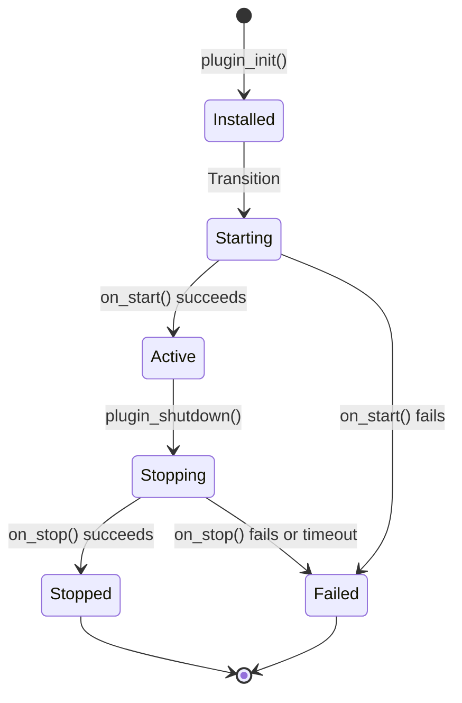

# Plugin Lifecycle Best Practices

This guide covers best practices for managing the rustbridge plugin lifecycle, including initialization, operation, shutdown, and reload patterns.

## Table of Contents

1. [Lifecycle Overview](#lifecycle-overview)
2. [Lifecycle States](#lifecycle-states)
3. [Plugin Initialization](#plugin-initialization)
4. [Plugin Operation](#plugin-operation)
5. [Plugin Shutdown](#plugin-shutdown)
6. [Plugin Reload](#plugin-reload)
7. [Global State Management](#global-state-management)
8. [Resource Cleanup](#resource-cleanup)
9. [Common Patterns](#common-patterns)
10. [Anti-Patterns to Avoid](#anti-patterns-to-avoid)

## Lifecycle Overview

A rustbridge plugin follows an OSGI-inspired lifecycle with six states:

```
Installed → Starting → Active → Stopping → Stopped → Failed
```

**Typical flow:**
1. **Load**: Host loads dynamic library and calls `plugin_init()`
2. **Start**: Framework transitions to Starting, calls `on_start()`
3. **Active**: Plugin ready to handle requests via `handle_request()`
4. **Shutdown**: Host calls `plugin_shutdown()`, framework calls `on_stop()`
5. **Stopped**: Plugin cleaned up, resources released

### Visual Lifecycle



## Lifecycle States

### 0: Installed
**Description**: Plugin loaded but not yet started.

**What happens:**
- Dynamic library loaded into memory
- `plugin_init()` called with configuration
- Plugin instance created
- Async runtime started
- Log callback registered (if provided)

**Valid operations:**
- None - plugin cannot handle requests yet

**Transitions to:**
- Starting (automatic)

### 1: Starting
**Description**: Plugin is starting up.

**What happens:**
- Framework calls `Plugin::on_start()`
- Plugin initializes resources (database connections, caches, etc.)
- Plugin performs any necessary startup validation

**Valid operations:**
- None - plugin cannot handle requests yet

**Transitions to:**
- Active (if `on_start()` succeeds)
- Failed (if `on_start()` fails)

### 2: Active
**Description**: Plugin is ready and handling requests.

**What happens:**
- Framework calls `Plugin::handle_request()` for each incoming request
- Requests are processed concurrently (within concurrency limits)
- Plugin maintains state and serves requests

**Valid operations:**
- `plugin_call()` - Handle requests
- `plugin_set_log_level()` - Change log level dynamically
- `plugin_get_state()` - Query current state
- `plugin_get_rejected_count()` - Get rejected request count

**Transitions to:**
- Stopping (when `plugin_shutdown()` is called)

### 3: Stopping
**Description**: Plugin is shutting down.

**What happens:**
- Framework calls `Plugin::on_stop()`
- Plugin releases resources
- In-flight requests complete or are cancelled
- Async runtime shuts down

**Valid operations:**
- None - new requests rejected

**Transitions to:**
- Stopped (if `on_stop()` succeeds within timeout)
- Failed (if `on_stop()` fails or times out)

### 4: Stopped
**Description**: Plugin has shut down cleanly.

**What happens:**
- All resources released
- Handle removed from registry
- Memory freed

**Transitions to:**
- None (terminal state)

### 5: Failed
**Description**: Plugin encountered an error and is unusable.

**What happens:**
- Logged error with details
- Resources released as much as possible
- Plugin cannot be recovered (must reload)

**Transitions to:**
- None (terminal state)

## Plugin Initialization

### Implementing on_start()

The `on_start()` method is where you initialize resources:

```rust
use async_trait::async_trait;
use rustbridge_core::{Plugin, PluginContext, PluginResult};
use sqlx::PgPool;
use std::sync::Arc;
use parking_lot::RwLock;

pub struct MyPlugin {
    db_pool: Arc<RwLock<Option<PgPool>>>,
    cache: Arc<RwLock<HashMap<String, String>>>,
}

#[async_trait]
impl Plugin for MyPlugin {
    async fn on_start(&self, ctx: &PluginContext) -> PluginResult<()> {
        tracing::info!("Starting plugin...");

        // Get database URL from config
        let db_url: String = ctx.config()
            .get("database_url")
            .ok_or_else(|| PluginError::ConfigError(
                "Missing required config: database_url".to_string()
            ))?;

        // Connect to database
        let pool = PgPool::connect(&db_url)
            .await
            .map_err(|e| PluginError::InitializationFailed(
                format!("Failed to connect to database: {}", e)
            ))?;

        // Store in plugin state
        *self.db_pool.write() = Some(pool);

        // Initialize cache
        *self.cache.write() = HashMap::new();

        tracing::info!("Plugin started successfully");
        Ok(())
    }

    // ... other trait methods
}
```

**Best practices:**
- ✅ Use `ctx.config()` to access configuration
- ✅ Return `PluginError::InitializationFailed` if startup fails
- ✅ Log startup progress
- ✅ Store resources in plugin state (not globals)
- ✅ Keep initialization fast (< 5 seconds if possible)
- ❌ Don't panic - return errors instead
- ❌ Don't block indefinitely - set timeouts

### Accessing Configuration

```rust
use serde::Deserialize;

#[derive(Deserialize)]
struct DatabaseConfig {
    url: String,
    max_connections: u32,
    timeout_seconds: u64,
}

async fn on_start(&self, ctx: &PluginContext) -> PluginResult<()> {
    // Get typed configuration
    let db_config: DatabaseConfig = ctx.config()
        .get("database")
        .ok_or_else(|| PluginError::ConfigError(
            "Missing database configuration".to_string()
        ))?;

    // Use configuration...
    tracing::info!("Connecting to database: {}", db_config.url);

    Ok(())
}
```

## Plugin Operation

### Handling Requests

```rust
async fn handle_request(
    &self,
    _ctx: &PluginContext,
    type_tag: &str,
    payload: &[u8],
) -> PluginResult<Vec<u8>> {
    tracing::debug!("Handling request: {}", type_tag);

    match type_tag {
        "user.get" => {
            let req: GetUserRequest = serde_json::from_slice(payload)?;

            // Access shared state safely
            let pool = self.db_pool.read()
                .as_ref()
                .ok_or_else(|| PluginError::InvalidState {
                    expected: "Active with database".to_string(),
                    actual: "No database connection".to_string(),
                })?
                .clone();

            // Perform database query
            let user = sqlx::query_as::<_, User>("SELECT * FROM users WHERE id = $1")
                .bind(req.user_id)
                .fetch_one(&pool)
                .await
                .map_err(|e| PluginError::HandlerError(e.to_string()))?;

            // Return response
            let response = GetUserResponse {
                user_id: user.id,
                username: user.username,
                email: user.email,
            };

            Ok(serde_json::to_vec(&response)?)
        }
        _ => Err(PluginError::UnknownMessageType(type_tag.to_string())),
    }
}
```

**Best practices:**
- ✅ Use `Arc<RwLock<T>>` for shared state
- ✅ Acquire locks for minimal duration
- ✅ Release locks before async operations
- ✅ Log errors with context
- ✅ Return specific error types
- ❌ Don't hold locks across `.await` points
- ❌ Don't panic on invalid input

## Plugin Shutdown

### Implementing on_stop()

The `on_stop()` method is where you clean up resources:

```rust
async fn on_stop(&self, _ctx: &PluginContext) -> PluginResult<()> {
    tracing::info!("Stopping plugin...");

    // Close database connection
    if let Some(pool) = self.db_pool.write().take() {
        pool.close().await;
        tracing::info!("Database connection closed");
    }

    // Clear cache
    self.cache.write().clear();
    tracing::info!("Cache cleared");

    // Reset any global state (if using globals)
    if let Some(manager) = MANAGER.get() {
        *manager.write() = Manager::new();
    }

    tracing::info!("Plugin stopped successfully");
    Ok(())
}
```

**Best practices:**
- ✅ Close all connections (database, HTTP, etc.)
- ✅ Clear caches and temporary data
- ✅ Reset global state (if any)
- ✅ Use `Option::take()` to move resources out of locks
- ✅ Log shutdown progress
- ✅ Keep shutdown fast (< 5 seconds)
- ❌ Don't panic during shutdown
- ❌ Don't leave resources open

### Shutdown Timeout

The default shutdown timeout is 5 seconds (configurable via `PluginConfig.shutdown_timeout_ms`):

```java
PluginConfig config = PluginConfig.defaults()
    .shutdownTimeoutMs(10_000);  // 10 seconds
```

If `on_stop()` doesn't complete within the timeout:
- Plugin transitions to Failed state
- Resources may not be fully cleaned up
- Warning is logged

**Make sure your cleanup logic completes quickly.**

## Plugin Reload

### What is Reload?

Reload means:
1. Shut down a running plugin (`plugin_shutdown()`)
2. Optionally: Unload the dynamic library
3. Load the plugin again (`plugin_init()`)
4. Start it again

This is useful for:
- Updating plugin code without restarting the host application
- Recovering from failed state
- Switching configurations

### Reload Safety

rustbridge **fully supports** plugin reload with these guarantees:

✅ **Safe to reload:**
- Plugin can be unloaded and reloaded any number of times
- All functionality works correctly after reload
- Resources are properly cleaned up between reloads
- No memory leaks

⚠️ **Known limitations:**
- Log level persists across reloads (global state)
- Logging infrastructure is shared if multiple plugins loaded
- Tracing subscriber initialized once per process

### Reload Example (Java)

```java
// First load
try (Plugin plugin = FfmPluginLoader.load("libmyplugin.so")) {
    plugin.call("operation", request);
}
// Clean shutdown happens automatically (try-with-resources)

// Reload
try (Plugin plugin2 = FfmPluginLoader.load("libmyplugin.so")) {
    // Works perfectly - all functionality restored
    plugin2.call("operation", request);
}
```

### Reload Example (Kotlin)

```kotlin
// First load
FfmPluginLoader.load("libmyplugin.so").use { plugin ->
    plugin.call("operation", request)
}
// Clean shutdown

// Reload
FfmPluginLoader.load("libmyplugin.so").use { plugin ->
    plugin.call("operation", request)  // Works!
}
```

### Testing Reload

Always test your plugin with reload cycles:

```java
@Test
void reload___multiple_cycles___works() throws Exception {
    for (int i = 0; i < 3; i++) {
        try (Plugin plugin = FfmPluginLoader.load(PLUGIN_PATH)) {
            String response = plugin.call("echo", "{\"message\": \"test\"}");
            assertNotNull(response);
        }
    }
}
```

## Global State Management

### When to Use Global State

**Prefer plugin-scoped state:**
```rust
pub struct MyPlugin {
    // Stored in plugin instance - automatically cleaned up
    cache: Arc<RwLock<HashMap<String, Data>>>,
}
```

**Use globals only when necessary:**
- Shared caches across multiple plugin instances
- Process-wide resources (but consider per-plugin instead)
- Integration with third-party libraries requiring globals

### Safe Global State Patterns

If you must use global state, make it resettable:

```rust
use parking_lot::RwLock;
use std::sync::OnceLock;

static MANAGER: OnceLock<RwLock<Manager>> = OnceLock::new();

impl Plugin for MyPlugin {
    async fn on_start(&self, _ctx: &PluginContext) -> PluginResult<()> {
        // Initialize global on first use
        let manager = MANAGER.get_or_init(|| RwLock::new(Manager::new()));

        // Reset to default state
        *manager.write() = Manager::new();

        Ok(())
    }

    async fn on_stop(&self, _ctx: &PluginContext) -> PluginResult<()> {
        // Reset global state on shutdown
        if let Some(manager) = MANAGER.get() {
            *manager.write() = Manager::new();
        }

        Ok(())
    }
}
```

### Global State in rustbridge

The framework uses these globals (you don't need to manage them):

1. **HANDLE_MANAGER** - Stores active plugin handles (managed by framework)
2. **CALLBACK_MANAGER** - Manages FFI log callbacks (managed by framework)
3. **BINARY_HANDLERS** - Thread-local binary handlers (cleared on shutdown)
4. **ReloadHandle** - Tracing subscriber reload handle (persists across reloads)

## Resource Cleanup

### Database Connections

```rust
use sqlx::PgPool;
use parking_lot::RwLock;
use std::sync::Arc;

pub struct MyPlugin {
    db_pool: Arc<RwLock<Option<PgPool>>>,
}

impl Plugin for MyPlugin {
    async fn on_start(&self, ctx: &PluginContext) -> PluginResult<()> {
        let pool = PgPool::connect(&db_url).await?;
        *self.db_pool.write() = Some(pool);
        Ok(())
    }

    async fn on_stop(&self, _ctx: &PluginContext) -> PluginResult<()> {
        // Take ownership and close
        if let Some(pool) = self.db_pool.write().take() {
            pool.close().await;
        }
        Ok(())
    }
}
```

### HTTP Clients

```rust
use reqwest::Client;

pub struct MyPlugin {
    http_client: Arc<RwLock<Option<Client>>>,
}

impl Plugin for MyPlugin {
    async fn on_start(&self, _ctx: &PluginContext) -> PluginResult<()> {
        let client = Client::builder()
            .timeout(Duration::from_secs(30))
            .build()
            .map_err(|e| PluginError::InitializationFailed(e.to_string()))?;

        *self.http_client.write() = Some(client);
        Ok(())
    }

    async fn on_stop(&self, _ctx: &PluginContext) -> PluginResult<()> {
        // Client has no explicit close - just drop it
        *self.http_client.write() = None;
        Ok(())
    }
}
```

### File Handles

```rust
use tokio::fs::File;

async fn on_stop(&self, _ctx: &PluginContext) -> PluginResult<()> {
    // Take and drop file handle
    if let Some(file) = self.log_file.write().take() {
        drop(file);  // Explicitly close
    }

    Ok(())
}
```

### Timers and Background Tasks

```rust
use tokio::task::JoinHandle;

pub struct MyPlugin {
    background_task: Arc<RwLock<Option<JoinHandle<()>>>>,
}

impl Plugin for MyPlugin {
    async fn on_start(&self, _ctx: &PluginContext) -> PluginResult<()> {
        let handle = tokio::spawn(async {
            loop {
                tokio::time::sleep(Duration::from_secs(60)).await;
                // Periodic work...
            }
        });

        *self.background_task.write() = Some(handle);
        Ok(())
    }

    async fn on_stop(&self, _ctx: &PluginContext) -> PluginResult<()> {
        // Cancel background task
        if let Some(handle) = self.background_task.write().take() {
            handle.abort();
            // Optionally wait for it to finish
            let _ = handle.await;
        }

        Ok(())
    }
}
```

## Common Patterns

### Pattern 1: Lazy Initialization

Initialize resources on first use rather than in `on_start()`:

```rust
pub struct MyPlugin {
    cache: Arc<RwLock<HashMap<String, Data>>>,
}

impl Plugin for MyPlugin {
    async fn handle_request(...) -> PluginResult<Vec<u8>> {
        // Initialize on first use
        let mut cache = self.cache.write();
        if cache.is_empty() {
            *cache = load_initial_cache()?;
        }

        // Use cache...
    }
}
```

**When to use:**
- Expensive initialization that may not be needed
- Resources that depend on runtime conditions

### Pattern 2: Configuration Validation

Validate configuration in `on_start()` to fail fast:

```rust
async fn on_start(&self, ctx: &PluginContext) -> PluginResult<()> {
    // Validate required fields
    let api_key: String = ctx.config()
        .get("api_key")
        .ok_or_else(|| PluginError::ConfigError(
            "Missing required field: api_key".to_string()
        ))?;

    if api_key.is_empty() {
        return Err(PluginError::ConfigError(
            "api_key cannot be empty".to_string()
        ));
    }

    // Validate URL format
    let api_url: String = ctx.config().get("api_url").unwrap_or_default();
    if !api_url.starts_with("http://") && !api_url.starts_with("https://") {
        return Err(PluginError::ConfigError(
            "api_url must start with http:// or https://".to_string()
        ));
    }

    Ok(())
}
```

### Pattern 3: Health Checks

Provide a health check endpoint:

```rust
async fn handle_request(...) -> PluginResult<Vec<u8>> {
    match type_tag {
        "health" => {
            let healthy = self.check_health().await;

            let response = HealthResponse {
                status: if healthy { "healthy" } else { "unhealthy" },
                timestamp: SystemTime::now(),
            };

            Ok(serde_json::to_vec(&response)?)
        }
        // ... other handlers
    }
}

async fn check_health(&self) -> bool {
    // Check database connection
    if let Some(pool) = self.db_pool.read().as_ref() {
        if pool.is_closed() {
            return false;
        }
    }

    // Check other resources...

    true
}
```

### Pattern 4: Graceful Degradation

Continue operating with reduced functionality if optional resources fail:

```rust
async fn handle_request(...) -> PluginResult<Vec<u8>> {
    match type_tag {
        "get_user" => {
            // Try cache first
            if let Some(cached) = self.cache.read().get(&user_id) {
                return Ok(serde_json::to_vec(cached)?);
            }

            // Fall back to database
            if let Some(pool) = self.db_pool.read().as_ref() {
                let user = fetch_from_db(pool, user_id).await?;
                return Ok(serde_json::to_vec(&user)?);
            }

            // Database unavailable - return error
            Err(PluginError::HandlerError(
                "Database unavailable".to_string()
            ))
        }
    }
}
```

## Anti-Patterns to Avoid

### ❌ Holding Locks Across Await Points

**BAD:**
```rust
async fn handle_request(...) -> PluginResult<Vec<u8>> {
    let cache = self.cache.write();  // Lock acquired

    let data = fetch_from_network().await;  // ❌ Holding lock while awaiting!

    cache.insert(key, data);
    Ok(serialize(data)?)
}
```

**GOOD:**
```rust
async fn handle_request(...) -> PluginResult<Vec<u8>> {
    let data = fetch_from_network().await;  // No lock held

    {
        let mut cache = self.cache.write();  // Lock acquired
        cache.insert(key, data.clone());
    }  // Lock released

    Ok(serialize(data)?)
}
```

### ❌ Non-Resettable Global State

**BAD:**
```rust
static mut COUNTER: AtomicUsize = AtomicUsize::new(0);

// This persists across reloads!
async fn handle_request(...) -> PluginResult<Vec<u8>> {
    let count = unsafe { COUNTER.fetch_add(1, Ordering::SeqCst) };
    // ...
}
```

**GOOD:**
```rust
pub struct MyPlugin {
    counter: Arc<AtomicUsize>,  // Plugin-scoped
}

async fn handle_request(...) -> PluginResult<Vec<u8>> {
    let count = self.counter.fetch_add(1, Ordering::SeqCst);
    // Automatically reset on plugin reload
}
```

### ❌ Panicking in Production Code

**BAD:**
```rust
async fn handle_request(...) -> PluginResult<Vec<u8>> {
    let req: MyRequest = serde_json::from_slice(payload)
        .unwrap();  // ❌ Panics on invalid JSON!
    // ...
}
```

**GOOD:**
```rust
async fn handle_request(...) -> PluginResult<Vec<u8>> {
    let req: MyRequest = serde_json::from_slice(payload)?;  // ✅ Returns error
    // ...
}
```

### ❌ Ignoring Shutdown Errors

**BAD:**
```rust
async fn on_stop(&self, _ctx: &PluginContext) -> PluginResult<()> {
    let _ = self.cleanup().await;  // ❌ Silently ignores errors
    Ok(())
}
```

**GOOD:**
```rust
async fn on_stop(&self, _ctx: &PluginContext) -> PluginResult<()> {
    self.cleanup().await
        .map_err(|e| {
            tracing::error!("Cleanup failed: {}", e);
            PluginError::ShutdownFailed(e.to_string())
        })?;

    Ok(())
}
```

### ❌ Blocking in Async Code

**BAD:**
```rust
async fn handle_request(...) -> PluginResult<Vec<u8>> {
    // ❌ Blocking the tokio runtime!
    std::thread::sleep(Duration::from_secs(5));
    Ok(vec![])
}
```

**GOOD:**
```rust
async fn handle_request(...) -> PluginResult<Vec<u8>> {
    // ✅ Async sleep doesn't block runtime
    tokio::time::sleep(Duration::from_secs(5)).await;
    Ok(vec![])
}
```

## Summary

**Key Takeaways:**

1. **Lifecycle States**: Understand the six states and valid transitions
2. **Initialization**: Use `on_start()` for resource setup, validate config, fail fast
3. **Operation**: Handle requests safely, use locks correctly, log errors
4. **Shutdown**: Clean up resources in `on_stop()`, reset global state
5. **Reload**: Test reload cycles, ensure clean shutdown
6. **Global State**: Prefer plugin-scoped state, make globals resettable
7. **Resource Cleanup**: Close connections, cancel tasks, free resources
8. **Patterns**: Use health checks, graceful degradation, configuration validation
9. **Anti-Patterns**: Avoid locks across awaits, panics, blocking, non-resettable globals

**Testing Checklist:**
- ✅ Plugin starts successfully with valid config
- ✅ Plugin fails gracefully with invalid config
- ✅ Plugin handles requests correctly
- ✅ Plugin shuts down cleanly
- ✅ Plugin can be reloaded multiple times
- ✅ Resources are fully cleaned up after shutdown
- ✅ No memory leaks across reload cycles

## Related Documentation

- [docs/GETTING_STARTED.md](./GETTING_STARTED.md) - Plugin creation tutorial
- [docs/ERROR_HANDLING.md](./ERROR_HANDLING.md) - Error handling patterns
- [docs/DEBUGGING.md](./DEBUGGING.md) - Debugging techniques
- [docs/SKILLS.md](./SKILLS.md) - Lock safety and best practices
- [docs/ARCHITECTURE.md](./ARCHITECTURE.md) - System architecture
- [docs/PLUGIN_RELOAD_STATUS.md](./PLUGIN_RELOAD_STATUS.md) - Reload status and limitations
