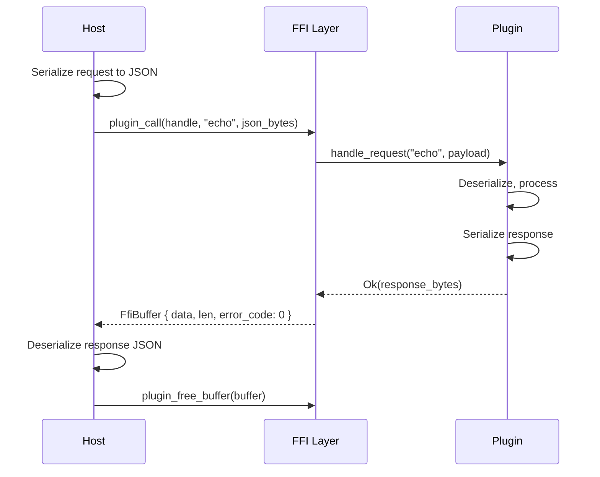

# Transport Layer

rustbridge supports two transport modes for FFI communication: JSON (default) and binary (opt-in for performance-critical paths).

## Overview

| Transport | Use Case | Serialization | Typical Latency |
|-----------|----------|---------------|-----------------|
| **JSON** | General purpose, flexibility | serde_json | ~650 ns |
| **Binary** | Performance-critical paths | Zero-copy C structs | ~90 ns |

## JSON Transport (Default)

JSON transport is the default and recommended approach for most use cases.

### Request/Response Envelopes

```rust
// Request from host to plugin
pub struct RequestEnvelope {
    pub type_tag: String,      // Message type identifier (e.g., "echo")
    pub payload: Vec<u8>,      // JSON-encoded payload
    pub request_id: Option<u64>, // Optional correlation ID
}

// Response from plugin to host
pub struct ResponseEnvelope {
    pub status: ResponseStatus, // "success" or "error"
    pub payload: Option<Vec<u8>>, // JSON-encoded response (success)
    pub error_code: Option<u32>,  // Error code (error)
    pub error_message: Option<String>, // Error message (error)
}
```

### Message Flow



### Example Usage

**Rust Plugin:**
```rust
async fn handle_request(
    &self,
    _ctx: &PluginContext,
    type_tag: &str,
    payload: &[u8],
) -> PluginResult<Vec<u8>> {
    match type_tag {
        "echo" => {
            let req: EchoRequest = serde_json::from_slice(payload)?;
            let resp = EchoResponse {
                message: req.message.clone(),
                length: req.message.len(),
            };
            Ok(serde_json::to_vec(&resp)?)
        }
        _ => Err(PluginError::UnknownMessageType(type_tag.to_string())),
    }
}
```

**Java:**
```java
String request = """{"message": "Hello"}""";
String response = plugin.call("echo", request);
// response: {"message":"Hello","length":5}
```

**Python:**
```python
request = json.dumps({"message": "Hello"})
response = plugin.call("echo", request)
result = json.loads(response)
```

### When to Use JSON

- Schema flexibility is needed
- Message sizes vary significantly
- Developer ergonomics matter more than raw performance
- Debugging/logging readability is important
- Cross-language interoperability is the priority

## Binary Transport (Opt-in)

Binary transport uses C-compatible structs for high-performance scenarios.

### Performance Comparison

| Metric | JSON | Binary | Improvement |
|--------|------|--------|-------------|
| Latency (small payload) | ~650 ns | ~90 ns | **7.1x faster** |
| Memory allocation | Dynamic | Fixed | Predictable |
| Message size | Variable | Fixed | Cacheable |

### When to Use Binary

- Request/response latency is critical (< 1μs target)
- Message structure is fixed and well-defined
- Calling from C/C++/Java FFM where struct mapping is natural
- High-frequency calls (>10K ops/s)

### Defining Binary Messages (Rust)

Binary messages must be `#[repr(C)]` structs with fixed layouts:

```rust
/// Message ID for routing
pub const MSG_ECHO: u32 = 1;

/// Request struct (must be #[repr(C)])
#[repr(C)]
#[derive(Debug, Clone, Copy)]
pub struct EchoRequestRaw {
    /// Struct version for forward compatibility
    pub version: u8,
    /// Reserved for alignment
    pub _reserved: [u8; 3],
    /// Message content (fixed-size buffer)
    pub message: [u8; 256],
    /// Actual message length
    pub message_len: u32,
}

/// Response struct
#[repr(C)]
#[derive(Debug, Clone, Copy)]
pub struct EchoResponseRaw {
    pub version: u8,
    pub _reserved: [u8; 3],
    pub message: [u8; 256],
    pub message_len: u32,
    pub length: u32,
}

impl EchoRequestRaw {
    pub const VERSION: u8 = 1;

    pub fn new(message: &str) -> Self {
        let mut msg_buf = [0u8; 256];
        let msg_bytes = message.as_bytes();
        let len = msg_bytes.len().min(256);
        msg_buf[..len].copy_from_slice(&msg_bytes[..len]);

        Self {
            version: Self::VERSION,
            _reserved: [0; 3],
            message: msg_buf,
            message_len: len as u32,
        }
    }
}
```

### Layout Rules

1. **Version field first** - Always include `version: u8` for forward compatibility
2. **Alignment padding** - Use `_reserved: [u8; N]` for natural alignment
3. **Fixed-size strings** - Use `[u8; N]` with a separate `*_len: u32` field
4. **No pointers** - Use inline arrays, not heap allocations
5. **8-byte alignment** - Align on 8 bytes for efficient access

### Registering Binary Handlers

```rust
use rustbridge_ffi::register_binary_handler;

pub fn register_handlers() {
    register_binary_handler(MSG_ECHO, handle_echo_raw);
}

fn handle_echo_raw(_handle: &PluginHandle, request: &[u8]) -> PluginResult<Vec<u8>> {
    // Validate size
    if request.len() < std::mem::size_of::<EchoRequestRaw>() {
        return Err(PluginError::HandlerError("Request too small".into()));
    }

    // Parse request (safe: validated size, repr(C) struct)
    let req = unsafe { &*(request.as_ptr() as *const EchoRequestRaw) };

    // Validate version
    if req.version != EchoRequestRaw::VERSION {
        return Err(PluginError::HandlerError(format!(
            "Unsupported version: {}", req.version
        )));
    }

    // Build response
    let response = EchoResponseRaw {
        version: 1,
        _reserved: [0; 3],
        message: req.message,
        message_len: req.message_len,
        length: req.message_len,
    };

    // Return as bytes
    let bytes = unsafe {
        std::slice::from_raw_parts(
            &response as *const _ as *const u8,
            std::mem::size_of::<EchoResponseRaw>(),
        )
    };
    Ok(bytes.to_vec())
}
```

## Language-Specific Usage

### Java FFM (Java 21+)

```java
import java.lang.foreign.*;

// Define struct layout
public static final StructLayout ECHO_REQUEST_LAYOUT = MemoryLayout.structLayout(
    ValueLayout.JAVA_BYTE.withName("version"),
    MemoryLayout.sequenceLayout(3, ValueLayout.JAVA_BYTE).withName("_reserved"),
    MemoryLayout.sequenceLayout(256, ValueLayout.JAVA_BYTE).withName("message"),
    ValueLayout.JAVA_INT.withName("message_len")
);

// Create and populate request
try (Arena arena = Arena.ofConfined()) {
    MemorySegment request = arena.allocate(ECHO_REQUEST_LAYOUT);
    request.set(ValueLayout.JAVA_BYTE, 0, (byte) 1);  // version

    // Set message
    String msg = "Hello";
    byte[] msgBytes = msg.getBytes(StandardCharsets.UTF_8);
    MemorySegment.copy(msgBytes, 0, request, 4, msgBytes.length);
    request.set(ValueLayout.JAVA_INT, 260, msgBytes.length);  // message_len

    // Call binary transport
    MemorySegment response = plugin.callRaw(MSG_ECHO, request, 268);

    // Read response
    int length = response.get(ValueLayout.JAVA_INT, 264);
}
```

### Java FFM Zero-Copy

For maximum performance, use zero-copy response handling:

```java
// Returns RawResponse with direct native memory access
RawResponse response = plugin.callRawZeroCopy(MSG_ECHO, request);
try {
    int length = response.segment().get(ValueLayout.JAVA_INT, 264);
} finally {
    response.close();  // Frees native memory
}
```

### C# (.NET)

```csharp
[StructLayout(LayoutKind.Sequential, Pack = 1)]
public unsafe struct EchoRequestRaw
{
    public byte Version;
    private fixed byte _reserved[3];
    private fixed byte _message[256];
    public uint MessageLen;

    public void SetMessage(string msg)
    {
        var bytes = Encoding.UTF8.GetBytes(msg);
        var len = Math.Min(bytes.Length, 256);
        fixed (byte* ptr = _message)
        {
            Marshal.Copy(bytes, 0, (IntPtr)ptr, len);
        }
        MessageLen = (uint)len;
    }
}

// Usage
var request = new EchoRequestRaw { Version = 1 };
request.SetMessage("Hello");

var response = plugin.CallRaw(MSG_ECHO, ref request, 268);
```

### Python (ctypes)

```python
from ctypes import Structure, c_uint8, c_uint32, c_char, sizeof

class EchoRequestRaw(Structure):
    _pack_ = 1
    _fields_ = [
        ("version", c_uint8),
        ("_reserved", c_uint8 * 3),
        ("message", c_char * 256),
        ("message_len", c_uint32),
    ]

class EchoResponseRaw(Structure):
    _pack_ = 1
    _fields_ = [
        ("version", c_uint8),
        ("_reserved", c_uint8 * 3),
        ("message", c_char * 256),
        ("message_len", c_uint32),
        ("length", c_uint32),
    ]

# Create request
request = EchoRequestRaw()
request.version = 1
msg = b"Hello"
request.message = msg.ljust(256, b'\x00')
request.message_len = len(msg)

# Call binary transport
response = plugin.call_raw(MSG_ECHO, request, sizeof(EchoResponseRaw))
result = EchoResponseRaw.from_buffer_copy(response)
print(f"Length: {result.length}")
```

## Generating C Headers

Use the CLI to generate C headers from Rust structs:

```bash
rustbridge generate-header \
    --source src/binary_messages.rs \
    --output include/messages.h

# With compilation verification
rustbridge generate-header \
    --source src/binary_messages.rs \
    --output include/messages.h \
    --verify
```

**Generated header example:**

```c
#ifndef MESSAGES_H
#define MESSAGES_H

#include <stdint.h>

#define MSG_ECHO ((uint32_t)1)

typedef struct {
    uint8_t version;
    uint8_t _reserved[3];
    uint8_t message[256];
    uint32_t message_len;
} EchoRequestRaw;

typedef struct {
    uint8_t version;
    uint8_t _reserved[3];
    uint8_t message[256];
    uint32_t message_len;
    uint32_t length;
} EchoResponseRaw;

#endif
```

## Versioning and Compatibility

### Version Field

Every binary struct should start with a `version: u8` field:

```rust
#[repr(C)]
pub struct MyRequest {
    pub version: u8,       // First field
    pub _reserved: [u8; 7], // Reserved for future use
    pub field_a: u32,
    pub field_b: u32,
}
```

### Adding Fields

Use reserved space to add fields without breaking compatibility:

```rust
// Version 1
#[repr(C)]
pub struct MyRequestV1 {
    pub version: u8,
    pub _reserved: [u8; 7],
    pub field_a: u32,
}

// Version 2 - uses reserved space
#[repr(C)]
pub struct MyRequestV2 {
    pub version: u8,
    pub new_flag: u8,      // New field
    pub _reserved: [u8; 6], // Less reserved space
    pub field_a: u32,
}
```

### Handler Compatibility

Support multiple versions in handlers:

```rust
fn handle_request(request: &[u8]) -> PluginResult<Vec<u8>> {
    let version = request[0];

    match version {
        1 => handle_v1(request),
        2 => handle_v2(request),
        _ => Err(PluginError::HandlerError(
            format!("Unsupported version: {}", version)
        )),
    }
}
```

## Error Handling

### Binary Transport Error Codes

| Code | Meaning |
|------|---------|
| 0 | Success |
| 2 | InvalidRequest (bad size/version) |
| 4 | HandlerNotFound (unknown message ID) |
| 5 | HandlerError (processing failed) |
| 11 | InternalError (panic caught) |

### Response Structure

Binary responses use `RbResponse` wrapper:

```c
typedef struct {
    uint8_t* data;      // Pointer to response struct
    size_t len;         // Response size
    size_t capacity;    // Allocation capacity
    uint32_t error_code; // 0 = success
} RbResponse;
```

## Migration Checklist

When migrating a JSON endpoint to binary:

- [ ] Define `#[repr(C)]` request/response structs with version field
- [ ] Add message ID constant
- [ ] Implement and register binary handler
- [ ] Generate C header with CLI
- [ ] Create Java/C#/Python struct wrappers
- [ ] Update client code to use `callRaw()`
- [ ] Benchmark to verify improvement

## Performance Tips

1. **Reuse allocations** - Keep request structs alive across calls
2. **Batch operations** - Group multiple operations into array requests
3. **Align on 8 bytes** - Ensures efficient memory access
4. **Avoid copies** - Use zero-copy methods where available
5. **Profile first** - Verify binary transport is actually needed

## Related Documentation

- [MEMORY_MODEL.md](./MEMORY_MODEL.md) - Memory ownership patterns
- [BUNDLE_FORMAT.md](./BUNDLE_FORMAT.md) - Schema embedding in bundles
- [BENCHMARK_RESULTS.md](./BENCHMARK_RESULTS.md) - Performance comparisons
